# Architecture Document
# Marketing Campaign Assistant v2 — Microservices Architecture

**Version:** 3.1  
**Last Updated:** April 1, 2026  
**Platform:** Red Hat OpenShift AI 3.3

---

## Table of Contents

1. [System Overview](#1-system-overview)
2. [Service Inventory](#2-service-inventory)
3. [High-Level Architecture](#3-high-level-architecture)
4. [Data Flow: Campaign Lifecycle](#4-data-flow-campaign-lifecycle)
5. [A2A Protocol Flow](#5-a2a-protocol-flow)
6. [MCP Protocol Flow](#6-mcp-protocol-flow)
7. [LangGraph Workflows](#7-langgraph-workflows)
8. [SSE Event System](#8-sse-event-system)
9. [Kubernetes Deployment Flow](#9-kubernetes-deployment-flow)
10. [Frontend Architecture](#10-frontend-architecture)
11. [GPU & Model Assignment](#11-gpu--model-assignment)
12. [Detailed Service Reference](#12-detailed-service-reference)

---

## 1. System Overview

The Marketing Campaign Assistant is a multi-agent AI system that generates luxury marketing campaigns for Macau casinos. It uses four protocols:

| Protocol | Purpose | Implementation |
|----------|---------|----------------|
| **A2A** (Agent-to-Agent) | Inter-agent communication | `a2a-sdk` JSON-RPC 2.0 over HTTP |
| **MCP** (Model Context Protocol) | Tool access (database, image gen) | FastMCP streamable-http transport |
| **OpenAI API** | LLM inference (Qwen models) | vLLM-compatible `/v1/chat/completions` |
| **SSE** (Server-Sent Events) | Real-time UI updates | Flask-based Event Hub |

---

## 2. Service Inventory

| Service | Port | Technology | Role |
|---------|------|------------|------|
| **Frontend** | 8080 (nginx) | React 18, TypeScript, nginx | Static SPA + API/SSE proxy |
| **Campaign API** | 5000 | Flask, Flask-CORS | REST gateway, A2A client to Director |
| **Event Hub** | 5001 | Flask | SSE pub/sub for real-time agent status |
| **Campaign Director** | 8080 | a2a-sdk, LangGraph, Starlette | Orchestrator, workflow coordination |
| **Creative Producer** | 8081 | a2a-sdk, FastMCP Client | HTML/CSS landing page generation |
| **Customer Analyst** | 8082 | a2a-sdk, FastMCP Client, Qwen3 | LLM-driven customer retrieval via MCP |
| **Delivery Manager** | 8083 | a2a-sdk, Kubernetes client | Email generation + K8s deployment |
| **MongoDB MCP** | 8090 | FastMCP streamable-http | Customer database tools |
| **ImageGen MCP** | 8091 | FastMCP hybrid + Starlette | AI image generation + serving |
| **Campaign Landing** | 8080 (per-campaign) | Express.js, UBI9 Node 18 | Personalized landing pages (?c=VIP-001) |
| **MongoDB** | 27017 | mongo:7 | Customer/prospect database |
| **vLLM (Qwen Coder)** | KServe | vLLM, L40S #1 | HTML code generation |
| **vLLM (Qwen3)** | KServe | vLLM, L40S #2 | Email gen + tool calling |
| **vLLM-Omni (FLUX.2)** | KServe | vLLM-Omni 0.18.0, L40S #3 | Image generation |

---

## 3. High-Level Architecture

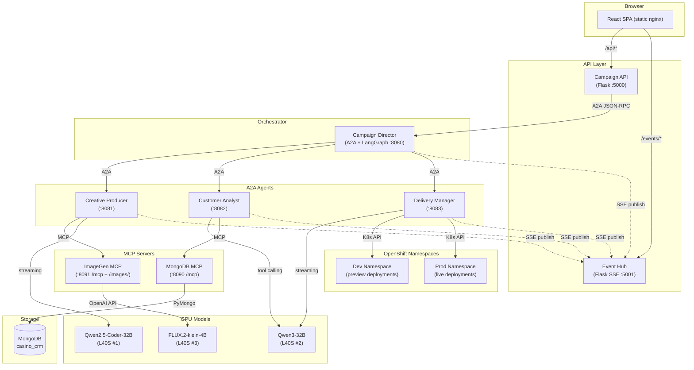

---

## 4. Data Flow: Campaign Lifecycle

### Step-by-Step Flow

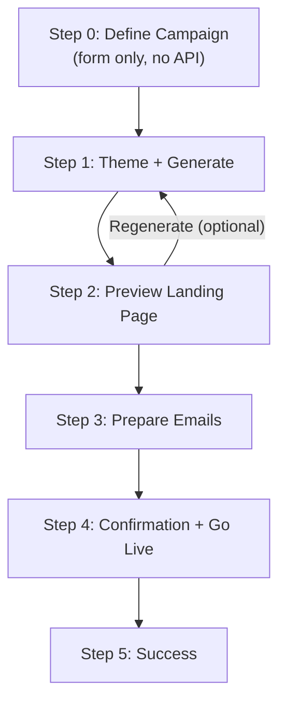

### Step 1: Landing Page Generation (detail)

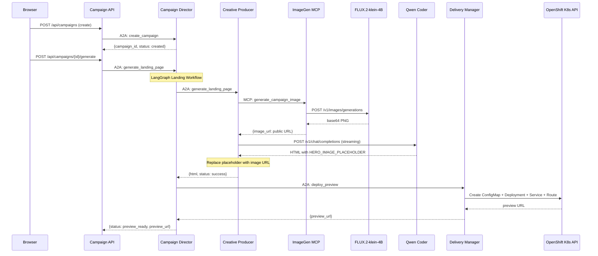

### Step 3: Email Preparation (detail)

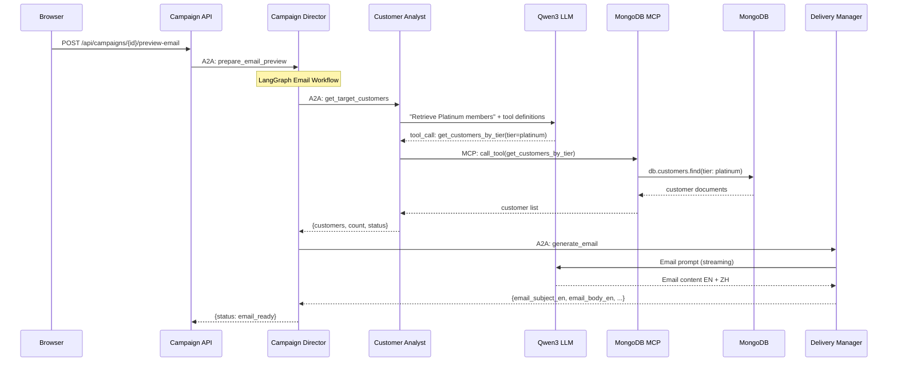

### Step 4: Go Live (detail)

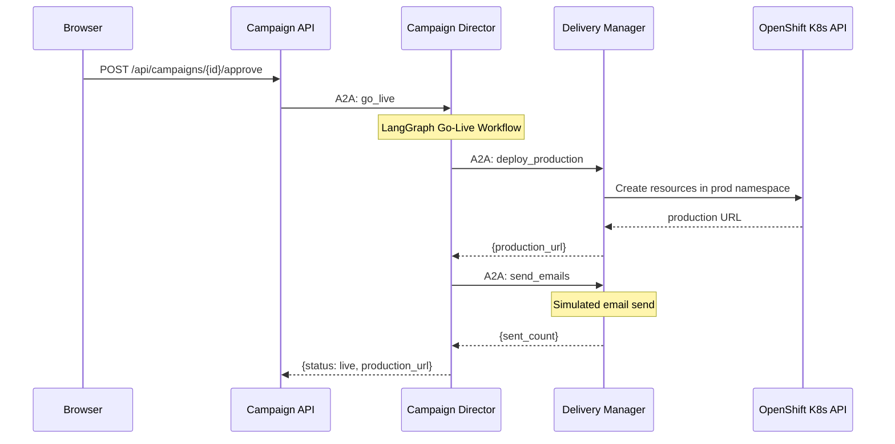

---

## 5. A2A Protocol Flow

### 3-Layer Agent Pattern

Every A2A agent follows this structure:

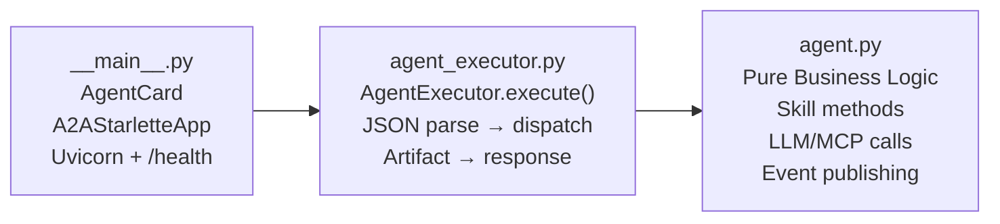

### Message Format

```json
{
  "jsonrpc": "2.0",
  "method": "message/send",
  "params": {
    "message": {
      "role": "user",
      "parts": [{"kind": "text", "text": "{\"skill\": \"generate_landing_page\", \"campaign_id\": \"abc123\", ...}"}],
      "messageId": "hex-uuid"
    }
  },
  "id": "request-uuid"
}
```

### Call Chain

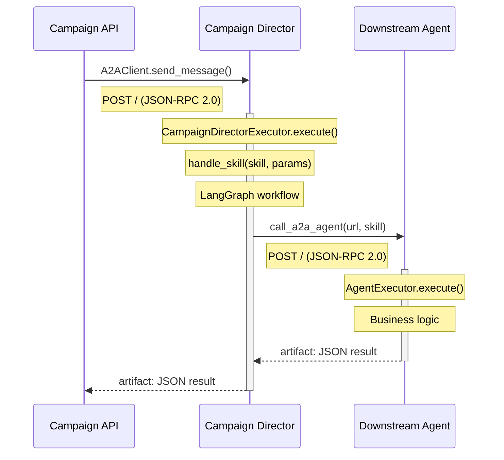

---

## 6. MCP Protocol Flow

### Transport: Streamable-HTTP

Both MCP servers use FastMCP's `streamable-http` transport at `/mcp`.

### MCP Client-Server Communication

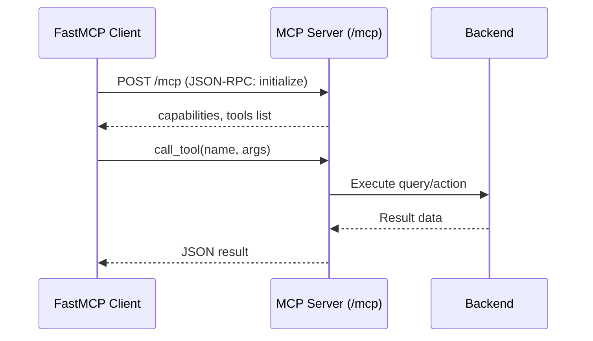

### Customer Analyst: LLM-Driven Tool Selection

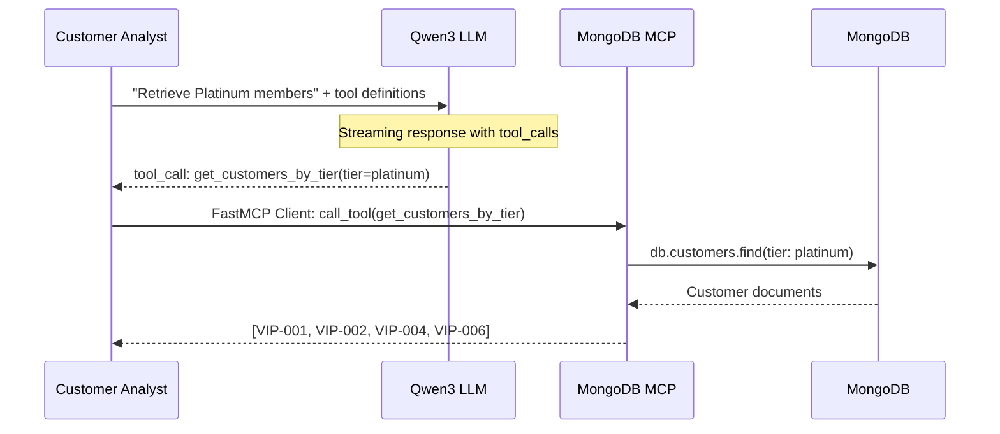

### ImageGen MCP: Hybrid Architecture

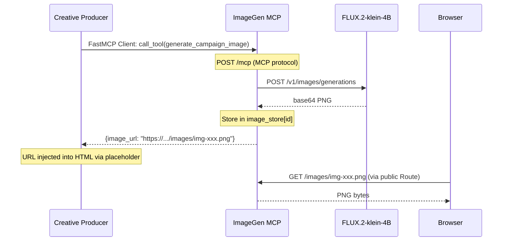

---

## 7. LangGraph Workflows

The Campaign Director orchestrates three sequential workflows using LangGraph `StateGraph`:

### Workflow 1: Landing Page Generation

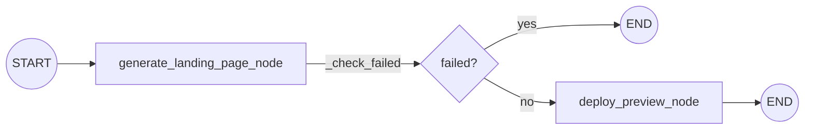

- `generate_landing_page_node`: A2A → Creative Producer → ImageGen MCP (hero image) + Qwen Coder (HTML)
- `deploy_preview_node`: A2A → Delivery Manager → K8s API (ConfigMap + Deployment + Service + Route in dev namespace)

### Workflow 2: Email Preview

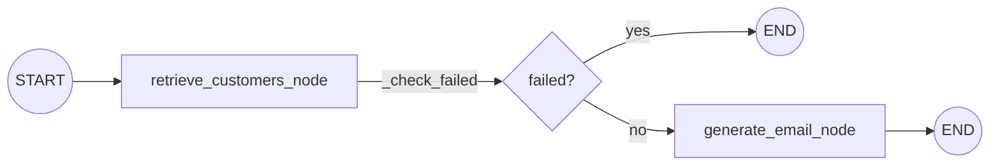

- `retrieve_customers_node`: A2A → Customer Analyst → Qwen3 LLM (tool selection) → MCP → MongoDB
- `generate_email_node`: A2A → Delivery Manager → Qwen3 LLM (email content EN + ZH)

### Workflow 3: Go Live

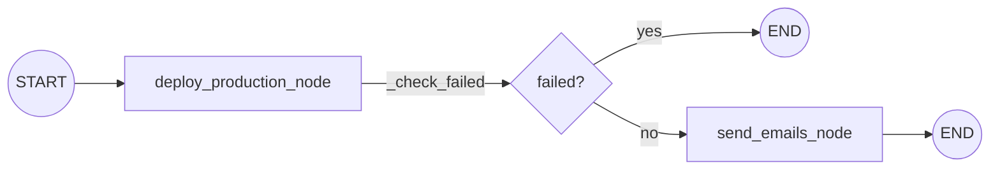

- `deploy_production_node`: A2A → Delivery Manager → K8s API (prod namespace)
- `send_emails_node`: A2A → Delivery Manager (simulated email send)

### Conditional Edge: `_check_failed`

Each workflow uses `add_conditional_edges` with `_check_failed(state)`:
- Returns `"end"` if `state["status"] == "failed"` → routes to `END`
- Returns `"continue"` otherwise → routes to next node

### State: `CampaignState` (TypedDict)

```python
class CampaignState(TypedDict):
    campaign_id: str
    campaign_name: str
    campaign_description: str
    hotel_name: str
    target_audience: str
    theme: str
    start_date: str
    end_date: str
    status: str
    landing_page_html: str
    preview_url: str
    production_url: str
    email_subject_en: str
    email_body_en: str
    email_subject_zh: str
    email_body_zh: str
    customer_list: List[dict]
    customer_count: int
    error_message: str
    messages: Annotated[list, operator.add]
```

---

## 8. SSE Event System

### Event Hub Architecture

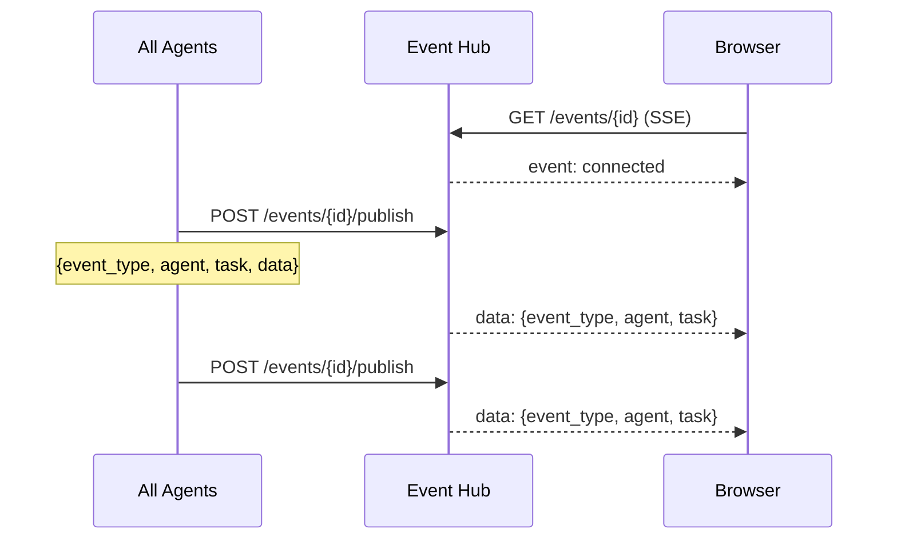

### Event Types

| Event Type | Published By | Meaning |
|------------|-------------|---------|
| `connected` | Event Hub | SSE connection established |
| `campaign_created` | Campaign Director | New campaign created |
| `workflow_status` | Campaign Director, Creative Producer, Customer Analyst | Workflow progress update |
| `agent_started` | All agents | Agent began processing a task |
| `agent_completed` | All agents | Agent finished a task successfully |
| `agent_error` | All agents | Agent encountered an error |

### Event Payload

```json
{
    "campaign_id": "abc123",
    "event_type": "agent_started",
    "agent": "Creative Producer",
    "task": "Generating hero image with AI",
    "data": {},
    "timestamp": "2026-03-31T15:00:00"
}
```

---

## 9. Kubernetes Deployment Flow

When the Delivery Manager deploys a campaign landing page:

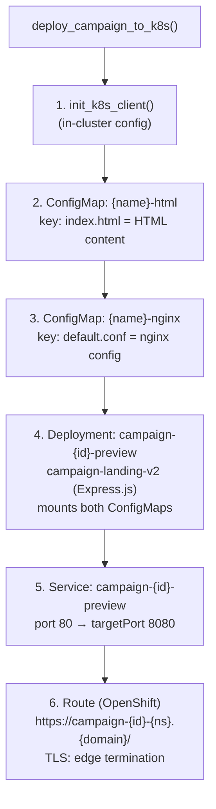

### Namespace Layout

| Namespace | Purpose |
|-----------|---------|
| `marketing-assistant-v2` | All application services (10 pods) |
| `0-marketing-assistant-demo-dev` | Preview campaign deployments |
| `0-marketing-assistant-demo-prod` | Production campaign deployments |
| `0-marketing-assistant-demo` | Model serving (vLLM, vLLM-Omni) |

### RBAC

`k8s/rbac.yaml` grants `edit` role to `system:serviceaccount:marketing-assistant-v2:default` in both dev and prod namespaces.

---

## 10. Frontend Architecture

### Nginx Proxy Configuration

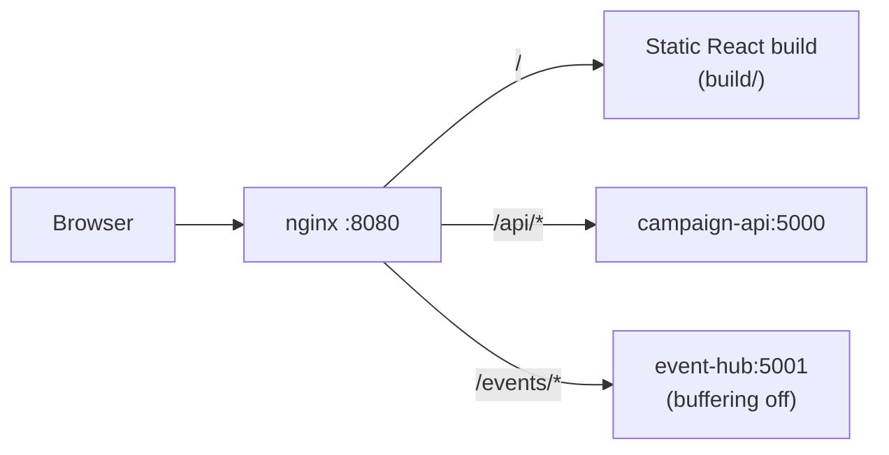

### React Routes

| Path | Component | Purpose |
|------|-----------|---------|
| `/` | Dashboard | Campaign list |
| `/campaign/create` | CampaignCreate | New campaign wizard |
| `/campaign/:id` | CampaignCreate | Resume existing campaign |

### Internal Step Machine

| `currentStep` | UI Label | Actions |
|---------------|----------|---------|
| 0 | "Step 1 of 4" | Form validation only |
| 1 | "Step 2 of 4" | Create campaign + generate landing page |
| 2 | Preview | Landing page preview + "Prepare Emails" |
| 3 | Email Preview | Email content + recipients |
| 4 | Confirmation | "Go Live Now" button |
| 5 | Success | Production URLs + QR codes |

### Status-to-Step Mapping (resume flow)

| Backend Status | Frontend Step |
|----------------|---------------|
| `draft`, `generating`, `failed` | 1 |
| `preview_ready` | 2 |
| `email_ready` | 3 |
| `approved`, `deploying` | 4 |
| `live` | 5 |

---

## 11. GPU & Model Assignment

| GPU | Model | Served By | Used By |
|-----|-------|-----------|---------|
| L40S #1 (48GB) | Qwen2.5-Coder-32B-FP8 | vLLM (KServe) | Creative Producer (HTML generation) |
| L40S #2 (48GB) | Qwen3-32B-FP8-Dynamic | vLLM (KServe) | Delivery Manager (email gen), Customer Analyst (tool calling) |
| L40S #3 (48GB) | FLUX.2-klein-4B | vLLM-Omni 0.18.0 (KServe) | ImageGen MCP (hero banner images) |

### Model Endpoints

```
Code Model:  https://qwen25-coder-32b-fp8-0-marketing-assistant-demo.{CLUSTER_DOMAIN}/v1
Lang Model:  https://qwen3-32b-fp8-dynamic-0-marketing-assistant-demo.{CLUSTER_DOMAIN}/v1
Image Model: https://flux2-klein-4b-0-marketing-assistant-demo.{CLUSTER_DOMAIN}/v1
```

All endpoints use kube-rbac-proxy authentication (Bearer token from ServiceAccount).

---

## 12. Detailed Service Reference

### Campaign API

| Route | Method | Handler | Downstream Call |
|-------|--------|---------|-----------------|
| `/health` | GET | `health_check` | — |
| `/api/themes` | GET | `get_themes` | `shared.models.CAMPAIGN_THEMES` |
| `/api/campaigns` | GET | `list_campaigns` | HTTP GET `{DIRECTOR}/campaigns` |
| `/api/campaigns` | POST | `create_campaign` | A2A → Director `create_campaign` |
| `/api/campaigns/<id>` | GET | `get_campaign` | HTTP GET `{DIRECTOR}/campaigns/{id}` |
| `/api/campaigns/<id>/generate` | POST | `generate_landing_page` | A2A → Director `generate_landing_page` |
| `/api/campaigns/<id>/preview-email` | POST | `preview_email` | A2A → Director `prepare_email_preview` |
| `/api/campaigns/<id>/approve` | POST | `approve_campaign` | A2A → Director `go_live` |

### Campaign Director

| Skill | Handler | LangGraph Workflow | Downstream A2A Calls |
|-------|---------|-------------------|---------------------|
| `create_campaign` | `_create_campaign` | — | — |
| `generate_landing_page` | `_generate_landing_page` | Landing workflow | Creative Producer → Delivery Manager |
| `prepare_email_preview` | `_prepare_email_preview` | Email workflow | Customer Analyst → Delivery Manager |
| `go_live` | `_go_live` | Go-live workflow | Delivery Manager (×2) |

### Creative Producer

| Skill | Handler | External Calls |
|-------|---------|----------------|
| `generate_landing_page` | `CreativeProducerAgent.generate()` | MCP → ImageGen MCP (`generate_campaign_image`), LLM → Qwen Coder (`/v1/chat/completions`, streaming) |

### Customer Analyst

| Skill | Handler | External Calls |
|-------|---------|----------------|
| `get_target_customers` | `CustomerAnalystAgent.get_customers()` | LLM → Qwen3 (tool calling, streaming), MCP → MongoDB MCP (tool execution) |

### Delivery Manager

| Skill | Handler | External Calls |
|-------|---------|----------------|
| `generate_email` | `DeliveryManagerAgent.generate_email()` | LLM → Qwen3 (`/v1/chat/completions`, streaming) |
| `deploy_preview` | `DeliveryManagerAgent.deploy_preview()` | K8s API (ConfigMap, Deployment, Service, Route) |
| `deploy_production` | `DeliveryManagerAgent.deploy_production()` | K8s API (prod namespace) |
| `send_emails` | `DeliveryManagerAgent.send_emails()` | Simulated (print to stdout) |

### MongoDB MCP

| MCP Tool | Parameters | Data Source |
|----------|-----------|-------------|
| `get_customers_by_tier` | `tier: str, limit: int` | `casino_crm.customers` |
| `get_prospects` | `limit: int` | `casino_crm.prospects` |
| `get_all_vip_customers` | `limit: int` | `casino_crm.customers` |
| `get_high_spend_customers` | `min_spend: int, limit: int` | `casino_crm.customers` |
| `search_customers` | `query: str, limit: int` | `casino_crm.customers` |
| `get_customer_count_by_tier` | — | `casino_crm.customers` (aggregation) |

### ImageGen MCP

| MCP Tool | Parameters | Returns |
|----------|-----------|---------|
| `generate_campaign_image` | `campaign_name, hotel_name, theme, description, width, height` | `{image_url, image_id, prompt, status}` |
| `generate_campaign_image_b64` | Same | `{data_uri, image_id, prompt, status}` |

| HTTP Route | Purpose |
|------------|---------|
| `GET /images/{id}.png` | Serve generated images from in-memory store |
| `GET /health` | Health check with stored image count |

### KAgent Discovery Labels

Both MCP deployments carry these labels for KAgent integration:

```yaml
kagenti.io/type: tool
protocol.kagenti.io/mcp: ""
kagenti.io/transport: streamable_http
app.kubernetes.io/name: <service-name>
```

---

## 13. Personalization Architecture

### How Personalized Landing Pages Work

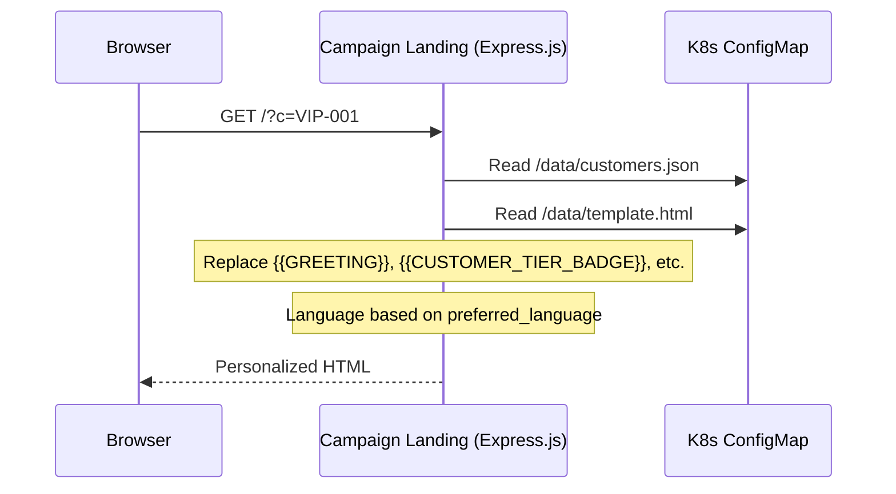

### Data Flow

1. **Step 1-2**: Creative Producer generates HTML with placeholders (`{{GREETING}}`, `{{CUSTOMER_TIER_BADGE}}`, `{{CUSTOMER_FIRST_NAME}}`)
2. **Step 1-2**: Delivery Manager deploys Express.js pod with `customers.json: []` (empty, customers not yet retrieved)
3. **Step 3**: Customer Analyst retrieves customers → Campaign Director re-deploys with populated `customers.json`
4. **Step 3+**: Frontend polls landing page until personalization is confirmed ready (no raw `{{GREETING}}` in response)
5. **VIP Dropdown**: User selects a customer from dropdown → opens `{url}?c=VIP-001` → sees personalized page

### Personalization Placeholders

| Placeholder | Example (English) | Example (Chinese) |
|-------------|-------------------|-------------------|
| `{{GREETING}}` | Your Exclusive Experience Awaits, John | 约翰，您的专属体验已就绪 |
| `{{CUSTOMER_NAME}}` | John Smith | 李明 |
| `{{CUSTOMER_FIRST_NAME}}` | John | 李明 |
| `{{CUSTOMER_TIER_BADGE}}` | Platinum VIP | Diamond Elite |
| `{{CUSTOMER_TIER_BADGE_ZH}}` | 铂金贵宾 | 钻石尊享会员 |

Bilingual: primary language first (larger), secondary below (smaller). Determined by `preferred_language` field.

### Campaign Landing Service

- **Image**: `quay.io/rh-ee-dayeo/marketing-assistant:campaign-landing-v2`
- **Base**: `registry.access.redhat.com/ubi9/nodejs-18`
- **Port**: 8080
- **Data mount**: `/data/` (ConfigMap with `template.html`, `customers.json`, `campaign.json`)
- **Routes**: `GET /` (personalized page), `GET /healthz`, `GET /readyz`
- **Generic view** (no `?c=`): "Honored Guest" / "尊贵来宾"
- **Prospect view** (`?c=PROSPECT-001`): "Exclusive Invitee" / "特邀嘉宾"

### Bilingual Strategy

- **English is always primary** (large text), Chinese is subtitle (smaller, below)
- Greeting: "Your Exclusive Experience Awaits, John" + "约翰，您的专属体验已就绪"
- Tier badges are split: `{{CUSTOMER_TIER_BADGE}}` = English only, `{{CUSTOMER_TIER_BADGE_ZH}}` = Chinese only
- Never mixed within the same line

### Creative Producer Post-Processing

After HTML generation, the Creative Producer injects fixes before deployment:
1. **Hero image**: `HERO_IMAGE_PLACEHOLDER` → actual public image URL
2. **Nav button CSS**: Injects `!important` styles for `header button` to prevent white/unstyled buttons using theme CSS variables (`--button-color`, `--button-text-color`)
3. **Proofreading**: LLM prompt instructs fixing typos/capitalization in campaign names

### Frontend VIP Preview

- **Dropdown selector** (not buttons) — scales to any number of customers
- **Personalization readiness polling**: after email prep, frontend polls `{preview_url}?c=VIP-001` every 5 seconds until `{{GREETING}}` placeholder is gone (Express.js pod has restarted with customer data)
- **Dynamic QR code**: updates when a VIP is selected from dropdown
- **Disabled state**: dropdown is greyed out with "Syncing..." spinner until personalization is confirmed ready

---

## 14. Observability

### OpenTelemetry

All pod templates have annotations for auto-instrumentation:
- Python services: `instrumentation.opentelemetry.io/inject-python: "true"`
- Frontend (nginx): `instrumentation.opentelemetry.io/inject-nodejs: "true"`
- All: `sidecar.opentelemetry.io/inject: app-sidecar`

### Prometheus Metrics (Campaign API)

Endpoint: `GET /metrics` on campaign-api (port 5000)

| Metric | Type | Description |
|--------|------|-------------|
| `campaigns_created_total` | Counter | Total campaigns created |
| `campaigns_live_total` | Counter | Total campaigns gone live |
| `agent_calls_total{skill}` | Counter | A2A calls to director by skill |
| `campaign_step_duration_seconds{step}` | Histogram | Duration of generate/email/golive steps |
| `active_campaigns` | Gauge | Currently in-progress campaigns |

### Health Endpoints

All services expose:
- `GET /healthz` — Liveness probe
- `GET /readyz` — Readiness probe

---

## 15. Deployment (Kustomize)

### Directory Structure

```
k8s/
├── base/                    # Namespace-agnostic manifests
│   ├── kustomization.yaml   # Lists all 15 resources
│   ├── configmap.yaml       # Generic config (service URLs, model names)
│   ├── namespace.yaml
│   ├── rbac.yaml
│   ├── agents/
│   ├── api/
│   ├── frontend/
│   └── mcp/
├── overlays/
│   └── dev/                 # Cluster-specific
│       ├── kustomization.yaml
│       ├── configmap-patch.yaml   # CLUSTER_DOMAIN, namespaces, SELF_URL
│       └── secret.yaml            # Model endpoints + tokens (template)
└── imagegen/
    └── serving-runtime.yaml       # vLLM-Omni runtime (imported via RHOAI UI)
```

### Deploy Command

```bash
# Edit secret.yaml with your model tokens first
oc apply -k k8s/overlays/dev
oc exec deployment/mongodb-mcp -- env MONGODB_URI=mongodb://mongodb:27017 python3 seed_data.py
```

### Base Images

All Python services: `registry.access.redhat.com/ubi9/python-311:latest`
Campaign Landing: `registry.access.redhat.com/ubi9/nodejs-18:latest`
Frontend: `nginxinc/nginx-unprivileged:alpine` (prebuilt React)

---

*Document maintained by: AI Demo Team*  
*Architecture based on Elastic Newsroom A2A pattern*
