# Architecture Document
# Marketing Campaign Assistant v2 — Microservices Architecture

**Version:** 6.0  
**Last Updated:** April 5, 2026  
**Platform:** Red Hat OpenShift AI 3.3

---

## Table of Contents

1. [System Overview](#1-system-overview)
2. [Service Inventory](#2-service-inventory)
3. [High-Level Architecture](#3-high-level-architecture)
4. [Data Flow: Campaign Lifecycle](#4-data-flow-campaign-lifecycle)
5. [A2A Protocol Flow](#5-a2a-protocol-flow)
6. [MCP Protocol Flow](#6-mcp-protocol-flow)
7. [LangGraph Workflows](#7-langgraph-workflows)
8. [SSE Event System](#8-sse-event-system)
9. [Kubernetes Deployment Flow](#9-kubernetes-deployment-flow)
10. [Frontend Architecture](#10-frontend-architecture)
11. [GPU & Model Assignment](#11-gpu--model-assignment)
12. [Detailed Service Reference](#12-detailed-service-reference)
18. [KAgenti Integration](#18-kagenti-integration)

---

## 1. System Overview

The Marketing Campaign Assistant is a multi-agent AI system that generates luxury marketing campaigns for Macau casinos. It uses four protocols:

**Product conventions (v5):** All customer-facing copy is **English-only** (no bilingual UI or email variants). The **hotel / casino** field is a **dropdown of five fictional Simon-branded venues** (not free text). **Competitor guardrails** match **fictional** competitor names only (for example **Jennifer Casino Resort** and similar demo patterns—not real licensed properties).

| Protocol | Purpose | Implementation |
|----------|---------|----------------|
| **A2A** (Agent-to-Agent) | Inter-agent communication | `a2a-sdk` JSON-RPC 2.0 over HTTP |
| **MCP** (Model Context Protocol) | Tool access (database, image gen) | FastMCP 3.x http transport |
| **OpenAI API** | LLM inference (Qwen models) | vLLM-compatible `/v1/chat/completions` |
| **SSE** (Server-Sent Events) | Real-time UI updates | Flask-based Event Hub |

---

## 2. Service Inventory

| Service | Port | K8s a2a Port | KAgenti Labels | Technology | Role |
|---------|------|--------------|----------------|------------|------|
| **Frontend** | 8080 (nginx) | — | — | React 18, TypeScript, nginx | Static SPA + API/SSE proxy |
| **Campaign API** | 5000 | — | — | Flask, Flask-CORS | REST gateway, A2A client to Director |
| **Event Hub** | 5001 | — | — | Flask | SSE pub/sub for real-time agent status |
| **Campaign Director** | 8080 | 8080 | agent, LangGraph | a2a-sdk, LangGraph, Starlette | Orchestrator, workflow coordination |
| **Creative Producer** | 8081 | 8080 | agent, custom | a2a-sdk, FastMCP Client | Bones & Beauty skeleton template merge |
| **Customer Analyst** | 8082 | 8080 | agent, custom | a2a-sdk, FastMCP Client, Qwen3 | LLM-driven customer retrieval via MCP |
| **Delivery Manager** | 8083 | 8080 | agent, custom | a2a-sdk, Kubernetes client | Email generation + K8s deployment |
| **Policy Guardian** | 8084 | 8080 | agent, custom | a2a-sdk, Qwen3 | Business policy validation |
| **MongoDB MCP** | 8090 | — | tool, MCP, streamable_http | FastMCP 3.x http | Customer database tools |
| **ImageGen MCP** | 8091 | — | tool, MCP, streamable_http | FastMCP 3.x hybrid + Starlette | AI image generation + serving |
| **Campaign Landing** | 8080/pod | — | — | Express.js, UBI9 Node 18 | Personalized landing pages (?c=VIP-001) |
| **TrustyAI HAP Detector** | 8000 | — | — | Granite Guardian 125M (CPU) | Hate/abuse/profanity detection |
| **TrustyAI Prompt Injection** | 8000 | — | — | DeBERTa v3 (CPU) | Prompt injection detection |
| **GuardrailsOrchestrator** | 8032 | — | — | fms-guardrails-orchestrator | Detector coordination |
| **MongoDB** | 27017 | — | — | mongo:7 | Customer/prospect database |
| **vLLM (Qwen Coder)** | KServe | — | — | vLLM, L40S #1 | Style block + content key-values (skeleton merge) |
| **vLLM (Qwen3)** | KServe | — | — | vLLM, L40S #2 | Email gen + tool calling |
| **vLLM-Omni (FLUX.2)** | KServe | — | — | vLLM-Omni 0.18.0, L40S #3 | Image generation |

---

## 3. High-Level Architecture

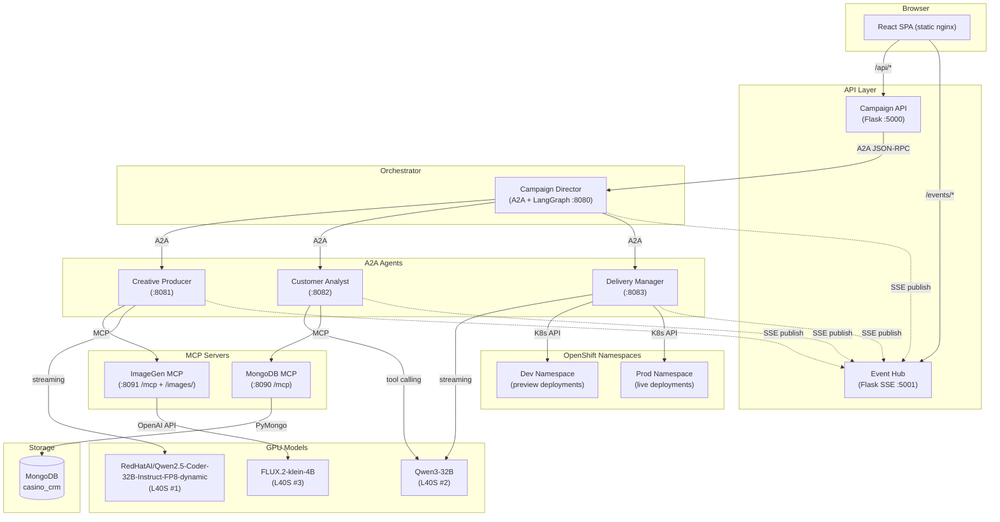

---

## 4. Data Flow: Campaign Lifecycle

### Step-by-Step Flow

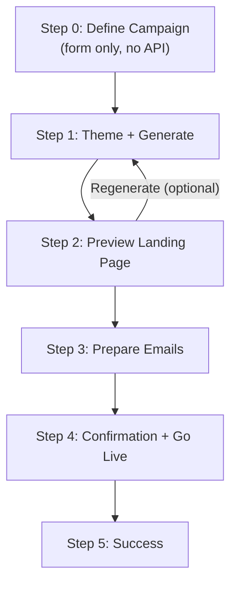

### Step 1: Landing Page Generation (detail)

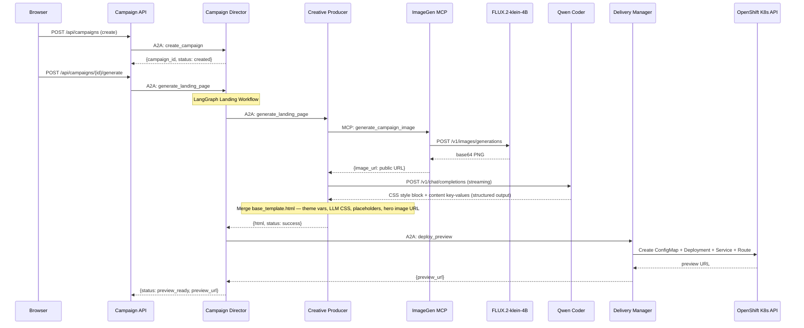

### Step 3: Email Preparation (detail)

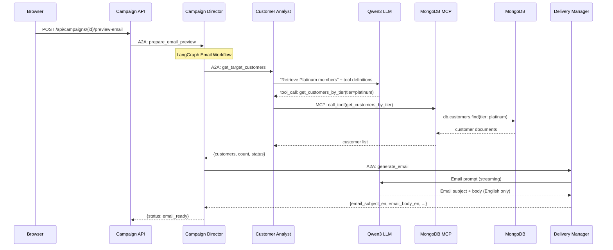

### Step 4: Go Live (detail)

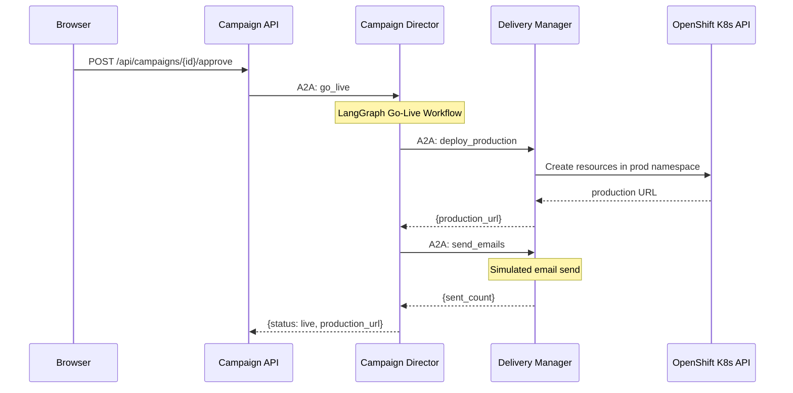

---

## 5. A2A Protocol Flow

### 3-Layer Agent Pattern

Every A2A agent follows this structure:

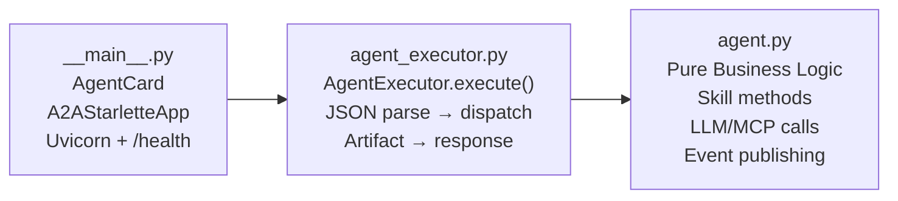

### Message Format

```json
{
  "jsonrpc": "2.0",
  "method": "message/send",
  "params": {
    "message": {
      "role": "user",
      "parts": [{"kind": "text", "text": "{\"skill\": \"generate_landing_page\", \"campaign_id\": \"abc123\", ...}"}],
      "messageId": "hex-uuid"
    }
  },
  "id": "request-uuid"
}
```

### Call Chain

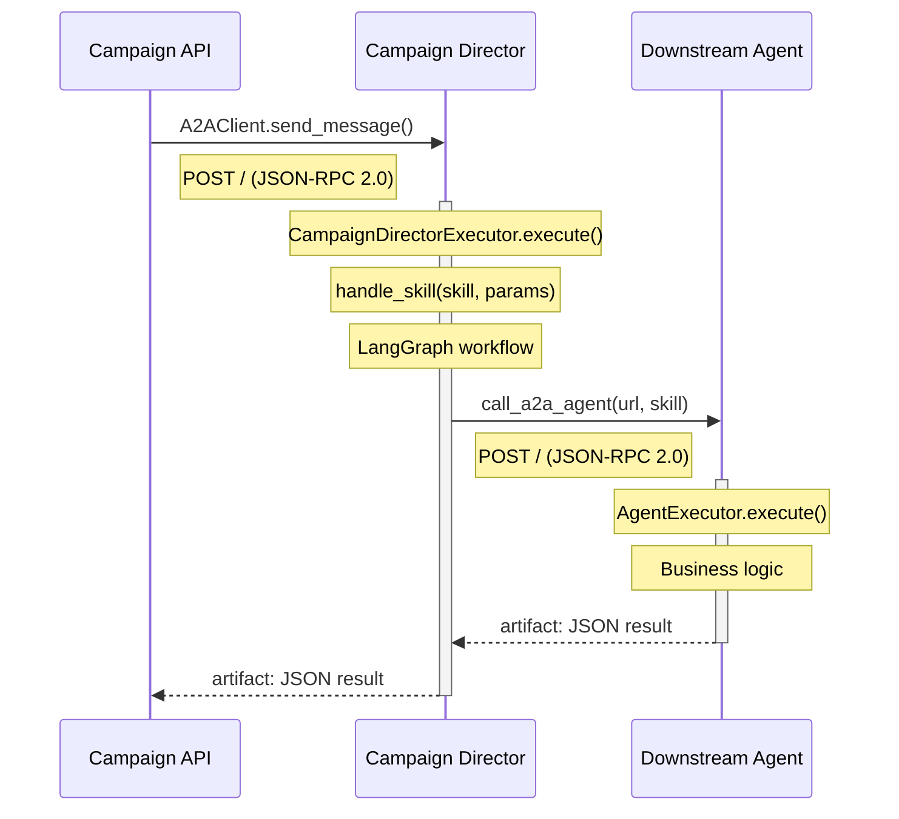

---

## 6. MCP Protocol Flow

### Transport: Streamable-HTTP

Both MCP servers use FastMCP 3.x's `http` transport at `/mcp` (Streamable HTTP protocol).

### MCP Client-Server Communication

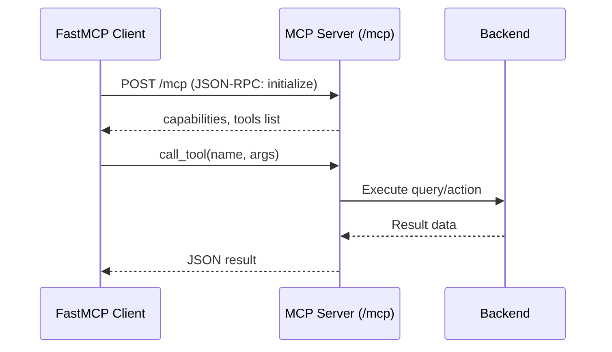

### Customer Analyst: LLM-Driven Tool Selection

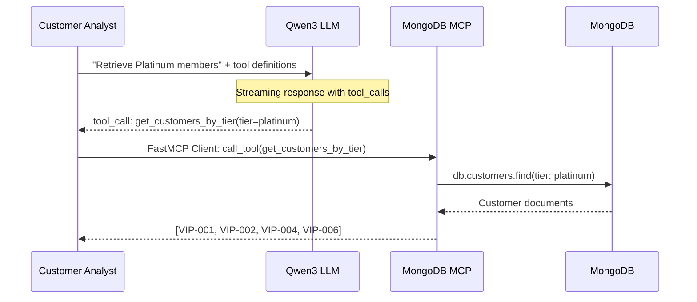

### ImageGen MCP: Hybrid Architecture

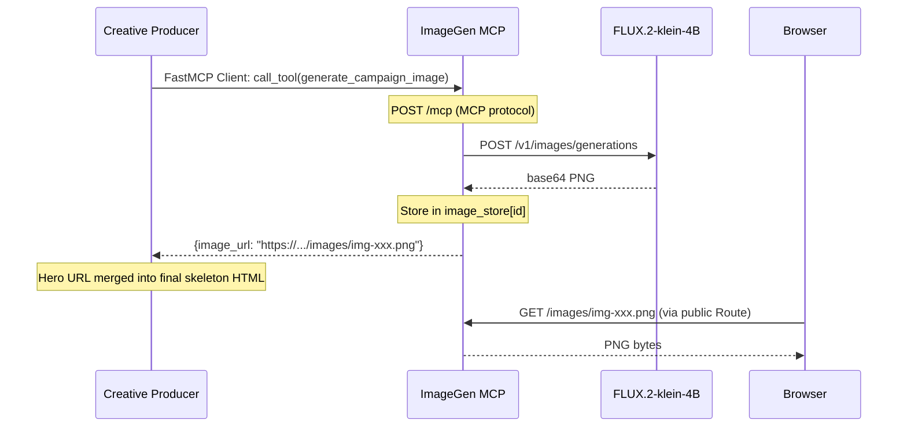

---

## 7. LangGraph Workflows

The Campaign Director orchestrates three sequential workflows using LangGraph `StateGraph`:

### Workflow 1: Landing Page Generation

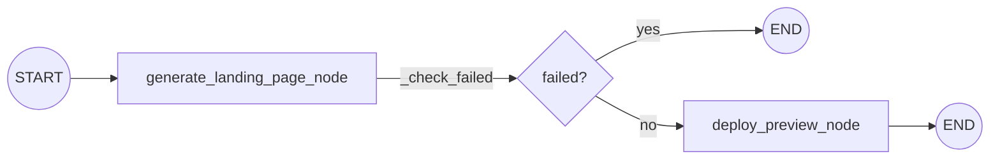

- `generate_landing_page_node`: A2A → Creative Producer → ImageGen MCP (hero image) + Qwen Coder (Digital Brand Architect: CSS + content keys merged into `base_template.html`)
- `deploy_preview_node`: A2A → Delivery Manager → K8s API (ConfigMap + Deployment + Service + Route in dev namespace)

### Workflow 2: Email Preview

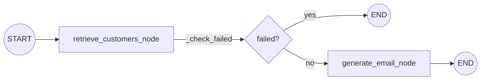

- `retrieve_customers_node`: A2A → Customer Analyst → Qwen3 LLM (tool selection) → MCP → MongoDB
- `generate_email_node`: A2A → Delivery Manager → Qwen3 LLM (email content, English only)

### Workflow 3: Go Live

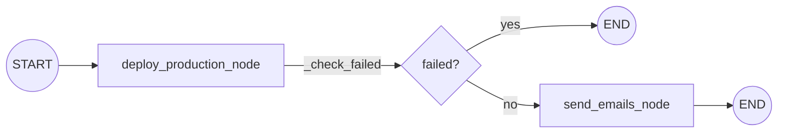

- `deploy_production_node`: A2A → Delivery Manager → K8s API (prod namespace)
- `send_emails_node`: A2A → Delivery Manager (simulated email send)

### Conditional Edge: `_check_failed`

Each workflow uses `add_conditional_edges` with `_check_failed(state)`:
- Returns `"end"` if `state["status"] == "failed"` → routes to `END`
- Returns `"continue"` otherwise → routes to next node

### State: `CampaignState` (TypedDict)

```python
class CampaignState(TypedDict):
    campaign_id: str
    campaign_name: str
    campaign_description: str
    hotel_name: str
    target_audience: str
    theme: str
    start_date: str
    end_date: str
    status: str
    landing_page_html: str
    preview_url: str
    production_url: str
    email_subject_en: str
    email_body_en: str
    customer_list: List[dict]
    customer_count: int
    error_message: str
    messages: Annotated[list, operator.add]
```

---

## 8. SSE Event System

### Event Hub Architecture

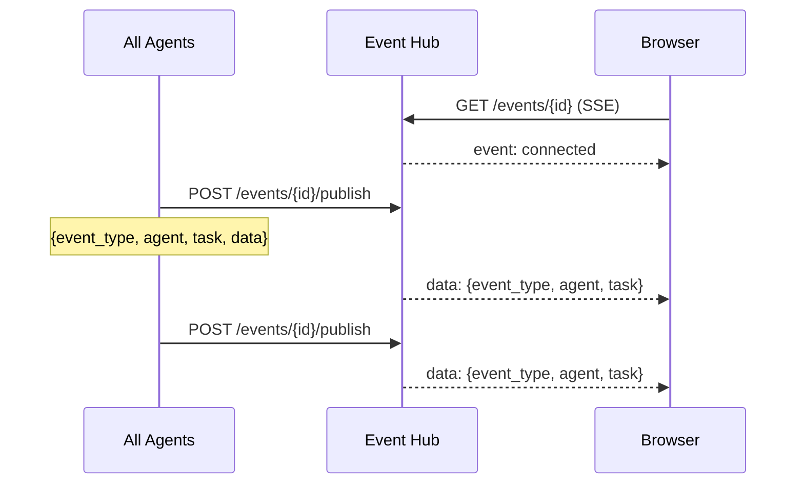

### Event Types

| Event Type | Published By | Meaning |
|------------|-------------|---------|
| `connected` | Event Hub | SSE connection established |
| `campaign_created` | Campaign Director | New campaign created |
| `workflow_status` | Campaign Director, Creative Producer, Customer Analyst | Workflow progress update |
| `agent_started` | All agents | Agent began processing a task |
| `agent_completed` | All agents | Agent finished a task successfully |
| `agent_error` | All agents | Agent encountered an error |

### Event Payload

```json
{
    "campaign_id": "abc123",
    "event_type": "agent_started",
    "agent": "Creative Producer",
    "task": "Creating campaign visuals...",
    "data": {},
    "timestamp": "2026-03-31T15:00:00"
}
```

---

## 9. Kubernetes Deployment Flow

When the Delivery Manager deploys a campaign landing page:

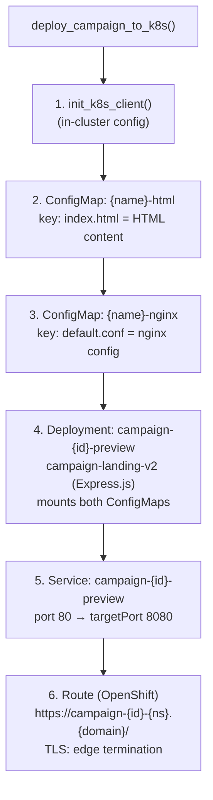

### Namespace Layout

The **primary application namespace** defaults to **`0-marketing-assistant-demo`**. Override before running `./deploy.sh` with `NAMESPACE=your-namespace` (the script patches Kustomize, `namespace.yaml`, ConfigMap URLs, and RBAC targets to match).

| Namespace | Purpose |
|-----------|---------|
| `{NAMESPACE}` (default `0-marketing-assistant-demo`) | Full stack: API, agents, MCP servers, MongoDB, frontend, guardrails, and model ServingRuntimes (as deployed on the cluster) |
| `{NAMESPACE}-dev` (default `…-dev`) | Per-campaign preview deployments (Express campaign-landing) |
| `{NAMESPACE}-prod` (default `…-prod`) | Per-campaign production deployments |

### RBAC

`k8s/rbac.yaml` grants `edit` to the **default** ServiceAccount in the app namespace (`system:serviceaccount:{NAMESPACE}:default`) on both dev and prod namespaces so the Delivery Manager can create Routes and ConfigMaps for campaign pods.

---

## 10. Frontend Architecture

**Campaign brief (Step 0):** **Hotel / casino** is chosen from a **dropdown of five fictional venues** (Simon Casino Resort, Simon Imperial Palace, Simon Oceanview Resort, Simon Golden Bay Hotel, Simon Jade Garden Spa & Resort)—aligned with guardrail-safe, demo-only naming.

### Nginx Proxy Configuration

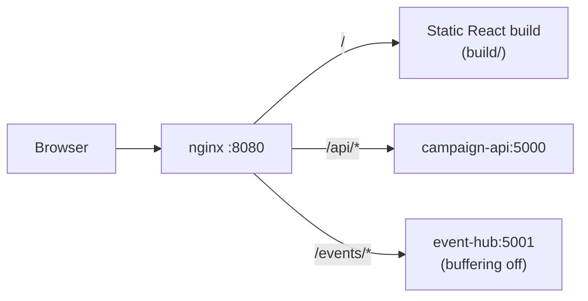

### React Routes

| Path | Component | Purpose |
|------|-----------|---------|
| `/` | Dashboard | Campaign list |
| `/campaign/create` | CampaignCreate | New campaign wizard |
| `/campaign/:id` | CampaignCreate | Resume existing campaign |

### Internal Step Machine

| `currentStep` | UI Label | Actions |
|---------------|----------|---------|
| 0 | "Step 1 of 4" | Form validation only |
| 1 | "Step 2 of 4" | Create campaign + generate landing page |
| 2 | Preview | Landing page preview + "Prepare Emails" |
| 3 | Email Preview | Email content + recipients |
| 4 | Confirmation | "Go Live Now" button |
| 5 | Success | Production URLs + QR codes |

### Status-to-Step Mapping (resume flow)

| Backend Status | Frontend Step |
|----------------|---------------|
| `draft`, `generating`, `failed` | 1 |
| `preview_ready` | 2 |
| `email_ready` | 3 |
| `approved`, `deploying` | 4 |
| `live` | 5 |

---

## 11. GPU & Model Assignment

| GPU | Model | Served By | Used By |
|-----|-------|-----------|---------|
| L40S #1 (48GB) | RedHatAI/Qwen2.5-Coder-32B-Instruct-FP8-dynamic | vLLM (KServe) | Creative Producer (skeleton merge: CSS + content keys) |
| L40S #2 (48GB) | Qwen3-32B-FP8-Dynamic | vLLM (KServe) | Delivery Manager (email gen), Customer Analyst (tool calling) |
| L40S #3 (48GB) | FLUX.2-klein-4B | vLLM-Omni 0.18.0 (KServe) | ImageGen MCP (hero banner images) |

### Model Endpoints

```
Code Model:  https://qwen25-coder-32b-fp8-0-marketing-assistant-demo.{CLUSTER_DOMAIN}/v1
             (served model id: RedHatAI/Qwen2.5-Coder-32B-Instruct-FP8-dynamic)
Lang Model:  https://qwen3-32b-fp8-dynamic-0-marketing-assistant-demo.{CLUSTER_DOMAIN}/v1
Image Model: https://flux2-klein-4b-0-marketing-assistant-demo.{CLUSTER_DOMAIN}/v1
```

All endpoints use kube-rbac-proxy authentication (Bearer token from ServiceAccount).

---

## 12. Detailed Service Reference

### Campaign API

| Route | Method | Handler | Downstream Call |
|-------|--------|---------|-----------------|
| `/health` | GET | `health_check` | — |
| `/api/themes` | GET | `get_themes` | `shared.models.CAMPAIGN_THEMES` |
| `/api/campaigns` | GET | `list_campaigns` | HTTP GET `{DIRECTOR}/campaigns` |
| `/api/campaigns` | POST | `create_campaign` | A2A → Director `create_campaign` |
| `/api/campaigns/<id>` | GET | `get_campaign` | HTTP GET `{DIRECTOR}/campaigns/{id}` |
| `/api/campaigns/<id>/generate` | POST | `generate_landing_page` | A2A → Director `generate_landing_page` |
| `/api/campaigns/<id>/preview-email` | POST | `preview_email` | A2A → Director `prepare_email_preview` |
| `/api/campaigns/<id>/approve` | POST | `approve_campaign` | A2A → Director `go_live` |

### Campaign Director

| Skill | Handler | LangGraph Workflow | Downstream A2A Calls |
|-------|---------|-------------------|---------------------|
| `create_campaign` | `_create_campaign` | — | — |
| `generate_landing_page` | `_generate_landing_page` | Landing workflow | Creative Producer → Delivery Manager |
| `prepare_email_preview` | `_prepare_email_preview` | Email workflow | Customer Analyst → Delivery Manager |
| `go_live` | `_go_live` | Go-live workflow | Delivery Manager (×2) |

### Creative Producer

The Creative Producer uses the **“Bones & Beauty”** pattern: a fixed **`base_template.html`** supplies document structure and **structural CSS** that must not be overridden by the model. The LLM adopts the persona **Digital Brand Architect** and returns a **CSS style block** plus **content key-value pairs**—not a full HTML document. Post-processing merges these into the template (documented under **Creative Producer Post-Processing**).

| Skill | Handler | External Calls |
|-------|---------|----------------|
| `generate_landing_page` | `CreativeProducerAgent.generate()` | MCP → ImageGen MCP (`generate_campaign_image`); LLM → Qwen Coder (`RedHatAI/Qwen2.5-Coder-32B-Instruct-FP8-dynamic`, streaming) for theme-aware styles and copy slots (merge pipeline in **Creative Producer Post-Processing**) |

### Customer Analyst

| Skill | Handler | External Calls |
|-------|---------|----------------|
| `get_target_customers` | `CustomerAnalystAgent.get_customers()` | LLM → Qwen3 (tool calling, streaming), MCP → MongoDB MCP (tool execution) |

### Delivery Manager

| Skill | Handler | External Calls |
|-------|---------|----------------|
| `generate_email` | `DeliveryManagerAgent.generate_email()` | LLM → Qwen3 (`/v1/chat/completions`, streaming) |
| `deploy_preview` | `DeliveryManagerAgent.deploy_preview()` | K8s API (ConfigMap, Deployment, Service, Route) |
| `deploy_production` | `DeliveryManagerAgent.deploy_production()` | K8s API (prod namespace) |
| `send_emails` | `DeliveryManagerAgent.send_emails()` | Simulated (print to stdout) |

### MongoDB MCP

| MCP Tool | Parameters | Data Source |
|----------|-----------|-------------|
| `get_customers_by_tier` | `tier: str, limit: int` | `casino_crm.customers` |
| `get_prospects` | `limit: int` | `casino_crm.prospects` |
| `get_all_vip_customers` | `limit: int` | `casino_crm.customers` |
| `get_high_spend_customers` | `min_spend: int, limit: int` | `casino_crm.customers` |
| `search_customers` | `query: str, limit: int` | `casino_crm.customers` |
| `get_customer_count_by_tier` | — | `casino_crm.customers` (aggregation) |

### ImageGen MCP

| MCP Tool | Parameters | Returns |
|----------|-----------|---------|
| `generate_campaign_image` | `campaign_name, hotel_name, theme, description, width, height` | `{image_url, image_id, prompt, status}` |
| `generate_campaign_image_b64` | Same | `{data_uri, image_id, prompt, status}` |

| HTTP Route | Purpose |
|------------|---------|
| `GET /images/{id}.png` | Serve generated images from in-memory store |
| `GET /health` | Health check with stored image count |

### KAgenti Discovery Labels

All agent and MCP deployments carry labels for [KAgenti](https://github.com/kagenti/kagenti) discovery:

**A2A Agents:**
```yaml
kagenti.io/type: agent
protocol.kagenti.io/a2a: ""
kagenti.io/framework: LangGraph   # Campaign Director
kagenti.io/framework: custom      # all other agents
```

**MCP Tool Servers:**
```yaml
kagenti.io/type: tool
protocol.kagenti.io/mcp: ""
kagenti.io/transport: streamable_http
app.kubernetes.io/name: <service-name>
```

See [Section 18: KAgenti Integration](#18-kagenti-integration) for full details on port normalization, security schemes, dual-mode input, and role-based access control.

---

## 13. Personalization Architecture

### Campaign theme palettes

Themes drive CSS variables injected during skeleton merge. Enum key `modern_black` is labeled **Modern Minimal** in the UI.

| Theme | Role | Palette (hex) |
|-------|------|----------------|
| **Luxury Gold** | Base / gold / shimmer accent | `#0F172A` (base), `#D4AF37` (gold), `#FDE047` (shimmer) |
| **Festive Red** | Maroon / crimson / gold | `#450A0A` (maroon), `#C41E3A` (crimson), `#B8860B` (gold) |
| **Modern Minimal** (formerly Modern Black) | White shell / dark controls | `#FFFFFF` (background), `#0F172A` (buttons / primary text) |
| **Classic Casino** | Emerald / amber | `#064E3B` (emerald), `#F59E0B` (amber) |

### How Personalized Landing Pages Work

```mermaid
sequenceDiagram
    participant Browser
    participant ExpressJS as Campaign Landing (Express.js)
    participant MCP as MongoDB MCP<br/>(app namespace)
    participant DB as MongoDB

    Browser->>ExpressJS: GET /?c=VIP-001 or ?c=PROSPECT-001
    ExpressJS->>ExpressJS: Read /data/template.html (ConfigMap)
    ExpressJS->>MCP: POST /mcp (initialize + tools/call)
    Note over ExpressJS,MCP: FQDN: mongodb-mcp.{NAMESPACE}.svc:8090 (landing pods often run in dev/prod NS)
    MCP->>DB: Resolve VIP customers and/or prospects (tool-specific queries)
    DB-->>MCP: Customer + prospect documents
    MCP-->>ExpressJS: Records (SSE JSON)
    Note over ExpressJS: VIP: real names; Prospect: "Distinguished Guest" / "Exclusive Invitee"
    Note over ExpressJS: Replace {{GREETING}}, {{CUSTOMER_TIER_BADGE}}, etc.
    Note over ExpressJS: Regex fallback for hardcoded "Guest" style strings
    ExpressJS-->>Browser: Personalized HTML (English only)
```

### Data Flow

1. **Step 1–2**: Creative Producer outputs merged HTML from `base_template.html` with content placeholders (`{{GREETING}}`, `{{CUSTOMER_TIER_BADGE}}`, `{{CUSTOMER_FIRST_NAME}}`, …).
2. **Step 1–2**: Delivery Manager deploys the Express.js campaign-landing pod; it calls MongoDB MCP using a **fully qualified** in-cluster URL to the **app** namespace (default `0-marketing-assistant-demo`, overridable via `deploy.sh` / `NAMESPACE`).
3. **On each request**: Campaign-landing loads **VIP customers** and **prospects** from MongoDB MCP (tools such as tier queries and `get_prospects`) so both audiences can be addressed by `?c=` without ConfigMap seeding of customer rows.
4. **Step 3+**: Frontend enables recipient dropdown after email prep completes.
5. **Dropdown**: User picks a VIP or prospect → opens `{url}?c={id}` → sees personalized copy (English only).

### Personalization Placeholders

All visible strings are **English**. There are no `_ZH` fields or secondary-language lines.

| Placeholder | Example |
|-------------|---------|
| `{{GREETING}}` | Your Exclusive Experience Awaits, John |
| `{{CUSTOMER_NAME}}` | John Smith |
| `{{CUSTOMER_FIRST_NAME}}` | John |
| `{{CUSTOMER_TIER_BADGE}}` | Platinum VIP |

### Campaign Landing Service

- **Image**: `quay.io/rh-ee-dayeo/marketing-assistant:campaign-landing`
- **Base**: `registry.access.redhat.com/ubi9/nodejs-18`
- **Port**: 8080
- **Data mount**: `/data/` (ConfigMap with `template.html`, `campaign.json`)
- **VIP + prospects**: Fetched from MongoDB MCP at request time (not bulk-synced via ConfigMap)
- **MCP URL**: `http://mongodb-mcp.{NAMESPACE}.svc:8090` with `{NAMESPACE}` = app namespace (e.g. `0-marketing-assistant-demo`). Must be FQDN from dev/prod campaign pods.
- **MCP protocol**: Requires `Accept: application/json, text/event-stream` header, `protocolVersion: "2024-11-05"`, `clientInfo`. Responses are SSE format (parsed via `parseSseJson()`)
- **Cache**: 60-second TTL, falls back to ConfigMap `customers.json` if MCP unavailable
- **Routes**: `GET /` (personalized page), `GET /healthz`, `GET /readyz`
- **Hardcoded text fallback**: `personalize()` maps generic LLM strings (e.g. "Honored Guest", "Guest") to tier or first name when MCP data is present
- **Generic view** (no `?c=`): e.g. "Honored Guest" (English)
- **Prospect view** (`?c=PROSPECT-…`): **Distinguished Guest** / **Exclusive Invitee** — **no real personal names**
- **Zero delay**: No pod restart needed for personalization — data is live from MCP

### Fake Inbox

- **Route**: `/inbox` (React page, link in top nav)
- **Default recipient**: **Wei Zhang** (`wei.zhang@example.com`)
- **Pre-populated**: Three **read** emails per known customer (English-only subjects and bodies: membership renewal, wine tasting, suite upgrade)
- **Campaign email**: Delivery Manager POSTs one personalized **English** email per recipient on Go Live (unread, bold)
- **Email links**: CTA uses `{{campaign_link}}`, replaced per recipient with `{production_url}?c={customer_id}`
- **API**: `GET /api/inbox?email=...`, `POST /api/inbox`, `POST /api/inbox/{id}/read` (campaign-api)
- **Auto-refresh**: Every 10 seconds
- **Per-recipient view**: Dropdown filter selects inbox per recipient

### Creative Producer Post-Processing (skeleton merge)

After the LLM returns **styles + content keys** (not full HTML), the Creative Producer builds the deployable document:

1. **Load** `base_template.html` (fixed structure; structural CSS cannot be broken by the model).
2. **Inject theme CSS variables** from the selected campaign theme (see **Campaign theme palettes** above).
3. **Inject the LLM CSS style block** into the designated region (scoped to template slots).
4. **Replace content placeholders** with LLM-provided key-value copy.
5. **Inject the hero image URL** from ImageGen MCP (public URL) into the hero slot.

**Note:** Avoid injecting broad wildcard CSS (e.g. `[class*="nav"]`) after merge — layout integrity comes from the template + LLM-scoped styles. A minimal overflow safety rule is acceptable when it does not fight template layout.

### Frontend VIP Preview

- **Dropdown selector** (not buttons) — scales to any number of customers and prospects
- **Personalization readiness polling**: after email prep, frontend polls `{preview_url}?c=…` until rendered HTML no longer shows raw `{{…}}` placeholders (MCP-backed data, no dependency on ConfigMap restarts)
- **Dynamic QR code**: updates when a recipient is selected from the dropdown
- **Disabled state**: dropdown is greyed out with a "Syncing…" spinner until personalization is confirmed ready

---

## 14. Observability

### OpenTelemetry

All pod templates have annotations for auto-instrumentation:
- Python services: `instrumentation.opentelemetry.io/inject-python: "true"`
- Frontend (nginx): `instrumentation.opentelemetry.io/inject-nodejs: "true"`
- All: `sidecar.opentelemetry.io/inject: app-sidecar`

### Prometheus Metrics (Campaign API)

Endpoint: `GET /metrics` on campaign-api (port 5000)

| Metric | Type | Description |
|--------|------|-------------|
| `campaigns_created_total` | Counter | Total campaigns created |
| `campaigns_live_total` | Counter | Total campaigns gone live |
| `agent_calls_total{skill}` | Counter | A2A calls to director by skill |
| `campaign_step_duration_seconds{step}` | Histogram | Duration of generate/email/golive steps |
| `active_campaigns` | Gauge | Currently in-progress campaigns |

### Health Endpoints

All services expose:
- `GET /healthz` — Liveness probe
- `GET /readyz` — Readiness probe

---

## 15. Deployment (Kustomize)

### Directory Structure

```
k8s/
├── base/                    # Namespace-agnostic manifests
│   ├── kustomization.yaml   # Lists all 15 resources
│   ├── configmap.yaml       # Generic config (service URLs, model names)
│   ├── namespace.yaml
│   ├── rbac.yaml
│   ├── agents/
│   ├── api/
│   ├── frontend/
│   └── mcp/
├── overlays/
│   └── dev/                 # Cluster-specific
│       ├── kustomization.yaml
│       ├── configmap-patch.yaml   # CLUSTER_DOMAIN, namespaces, SELF_URL
│       └── secret.yaml            # Model endpoints + tokens (template)
└── imagegen/
    └── serving-runtime.yaml       # vLLM-Omni runtime (imported via RHOAI UI)
```

### Deploy Command

```bash
# Edit secret.yaml with your model tokens first
oc apply -k k8s/overlays/dev
# Use the same namespace as deploy.sh (default 0-marketing-assistant-demo)
oc exec deployment/mongodb-mcp -n 0-marketing-assistant-demo -- env MONGODB_URI=mongodb://mongodb:27017 python3 seed_data.py
```

### Base Images

All Python services: `registry.access.redhat.com/ubi9/python-311:latest`
Campaign Landing: `registry.access.redhat.com/ubi9/nodejs-18:latest`
Frontend: `nginxinc/nginx-unprivileged:alpine` (prebuilt React)

### Operational scripts

| Script | Purpose |
|--------|---------|
| `deploy.sh` | Interactive OpenShift deploy; honors `NAMESPACE` (default `0-marketing-assistant-demo`), writes dev/prod namespace names, patches Kustomize and RBAC, applies manifests, optional guardrails |
| `update-app.sh` | Restarts core app Deployments in `NAMESPACE`, waits for rollouts, re-runs MongoDB seed via `mongodb-mcp` |
| `reset-demo.sh` | Deletes preview/prod campaign Deployments/Routes/ConfigMaps (keeps `campaign-basic-preview` in dev by default), restarts services to clear in-memory state |
| `seed-basic-campaign.sh` | Applies a static nginx “basic campaign” preview into `DEV_NS` (default `0-marketing-assistant-demo-dev`) from `k8s/basic-campaign.html` |

---

## 16. Guardrails Architecture

### 4-Layer Validation

All campaign content passes through 4 guardrail layers before creation:

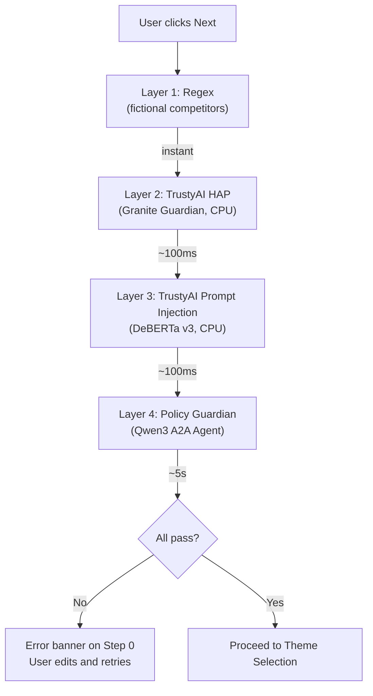

### Where Each Layer Runs

| Layer | Detector | Location | Resources |
|-------|----------|----------|-----------|
| 1. Regex | Fictional competitor-name patterns (e.g. Jennifer Casino Resort) | Campaign API (in-code) | None |
| 2. HAP | Granite Guardian 125M | KServe InferenceService | **CPU only** — no `nvidia.com/gpu` requests |
| 3. Prompt Injection | DeBERTa v3 | KServe InferenceService | **CPU only** — no `nvidia.com/gpu` requests |
| 4. Policy Guardian | Qwen3-32B (A2A agent) | Reuses L40S #2 | No extra GPU |

### TrustyAI Components

Deployed via Helm chart (lemonade-stand-assistant) or static YAMLs in `k8s/guardrails/`. **HAP and Prompt Injection detector InferenceServices are CPU-only** (no `nvidia.com/gpu` resource requests).

| Component | Purpose |
|-----------|---------|
| GuardrailsOrchestrator | Coordinates detectors (monitoring/dashboard) |
| HAP Detector (Granite Guardian) | Hate, abuse, profanity detection |
| Prompt Injection Detector (DeBERTa) | Jailbreak/manipulation detection |
| Regex Detector (sidecar) | Pattern-based blocking |
| MinIO | Downloads detector models from HuggingFace |
| Chunker | Sentence-level text splitting |
| Lingua | Language detection |

### Policy Guardian Agent

- **Service**: `services/policy-guardian/` (port 8084)
- **Protocol**: A2A (3-layer pattern)
- **Model**: Qwen3-32B (shared with Customer Analyst + Delivery Manager)
- **Skill**: `validate_campaign`
- **Rules**: No >50% discounts, professional tone, no misleading promises
- **Called from**: Campaign API validate endpoint (pre-creation)

### UX Flow on Rejection

1. User fills in campaign brief on Step 0
2. Clicks "Next: Select Theme"
3. Loading spinner: "Validating campaign through safety checks..."
4. If rejected: red error banner with reason, stays on Step 0
5. User edits description, clicks Next again
6. Error clears, re-validates
7. No campaign created until all 4 layers pass

---

## 17. Agent Summary

| # | Agent | Port | Model | Protocol | Purpose |
|---|-------|------|-------|----------|---------|
| 1 | Campaign Director | 8080 | — (orchestration) | A2A | LangGraph workflow coordination |
| 2 | Creative Producer | 8081 | RedHatAI/Qwen2.5-Coder-32B-Instruct-FP8-dynamic (L40S #1) | A2A | AI image + Bones & Beauty skeleton merge |
| 3 | Customer Analyst | 8082 | Qwen3 (L40S #2) | A2A + MCP | LLM tool calling for customer DB |
| 4 | Delivery Manager | 8083 | Qwen3 (L40S #2) | A2A | Email gen + K8s deployment |
| 5 | Policy Guardian | 8084 | Qwen3 (L40S #2) | A2A | Business policy validation |

| # | MCP Server | Port | Transport | Purpose |
|---|------------|------|-----------|---------|
| 1 | MongoDB MCP | 8090 | http (Streamable HTTP) | Customer database tools |
| 2 | ImageGen MCP | 8091 | http (hybrid + Starlette) | AI image generation + serving |

---

## 18. KAgenti Integration

[KAgenti](https://github.com/kagenti/kagenti) is a Kubernetes-native agent management framework that discovers and catalogs A2A agents and MCP tools via Kubernetes labels. This section documents all integration points.

### Discovery Labels

All agent and MCP deployments carry labels on `Deployment.metadata.labels`:

| Service | `kagenti.io/type` | Protocol Label | `kagenti.io/framework` | `kagenti.io/transport` |
|---------|-------------------|----------------|------------------------|------------------------|
| Campaign Director | `agent` | `protocol.kagenti.io/a2a: ""` | `LangGraph` | — |
| Creative Producer | `agent` | `protocol.kagenti.io/a2a: ""` | `custom` | — |
| Customer Analyst | `agent` | `protocol.kagenti.io/a2a: ""` | `custom` | — |
| Delivery Manager | `agent` | `protocol.kagenti.io/a2a: ""` | `custom` | — |
| Policy Guardian | `agent` | `protocol.kagenti.io/a2a: ""` | `custom` | — |
| MongoDB MCP | `tool` | `protocol.kagenti.io/mcp: ""` | — | `streamable_http` |
| ImageGen MCP | `tool` | `protocol.kagenti.io/mcp: ""` | — | `streamable_http` |

### Service Port Normalization

KAgenti expects A2A agents on port **8080**. Each agent's K8s Service exposes a named `a2a` port at 8080 that maps to the container's actual port:

```yaml
# Example: creative-producer Service
spec:
  ports:
  - name: a2a
    port: 8080
    targetPort: 8081      # container runs on 8081
  - name: original
    port: 8081
    targetPort: 8081      # backward compat for internal A2A calls
```

| Agent | Container Port | K8s Service `a2a` (8080 →) |
|-------|---------------|---------------------------|
| Campaign Director | 8080 | 8080 (native) |
| Creative Producer | 8081 | 8080 → 8081 |
| Customer Analyst | 8082 | 8080 → 8082 |
| Delivery Manager | 8083 | 8080 → 8083 |
| Policy Guardian | 8084 | 8080 → 8084 |

### Agent Card Discovery

All agents register two discovery endpoints:
- `GET /.well-known/agent.json` — a2a-sdk auto-generated (standard A2A)
- `GET /.well-known/agent-card.json` — explicit Starlette route (KAgenti compatibility)

The `url` field uses `os.getenv("AGENT_ENDPOINT", f"http://0.0.0.0:{port}")` so KAgenti can inject the agent's cluster-resolvable URL.

### Security Schemes

All five agent cards declare a Bearer JWT security scheme:

```python
from a2a.types import SecurityScheme, HTTPAuthSecurityScheme

securitySchemes={
    "Bearer": SecurityScheme(root=HTTPAuthSecurityScheme(
        type="http", scheme="bearer", bearerFormat="JWT",
        description="OAuth 2.0 JWT token"
    ))
}
```

This advertises the expected authentication mechanism. Token validation is handled by the platform (OpenShift OAuth proxy or KAgenti auth).

### Dual-Mode Input (Structured + Chat)

Each agent executor supports both JSON skill dispatch (from Campaign API / Director) and plain-text natural language (from KAgenti chat UI):

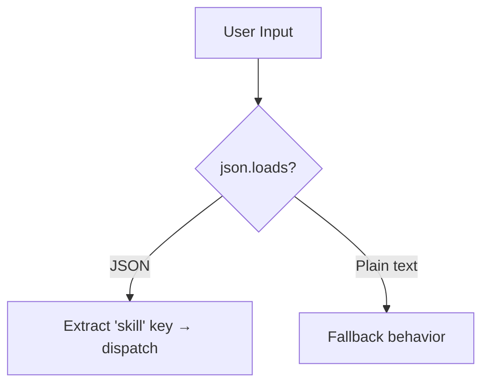

| Agent | JSON Path | Plain-Text Fallback |
|-------|-----------|---------------------|
| Campaign Director | `skill` + params → LangGraph dispatch | `chat` skill → conversational campaign summary |
| Creative Producer | Full params → generate landing page | Text used as `campaign_description`, defaults filled |
| Customer Analyst | Full params → MCP tool calling | Text used as `target_audience` |
| Policy Guardian | Full params → validate campaign | Text used as both `campaign_name` and `campaign_description` |
| Delivery Manager | `skill` + params → skill dispatch | Returns guidance message (structured input required) |

### MongoDB MCP Role-Based Access

The MongoDB MCP server includes KAgenti-aware tier filtering via `allowed_tiers`:

```python
TIER_SCOPES = {
    "tier-admin":    ["diamond", "platinum", "gold"],
    "tier-diamond":  ["diamond", "platinum", "gold"],
    "tier-platinum": ["platinum", "gold"],
    "tier-gold":     ["gold"],
}

@mcp.tool
def get_all_vip_customers(limit: int = 100, allowed_tiers: str = "") -> List[dict]:
    # Empty string = no filter (backward compatible with direct usage)
    # Role string from KAgenti = scoped to matching tiers
```

### KAgenti Chat Flow

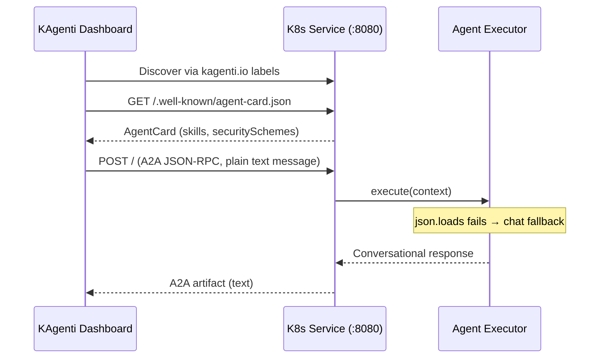

---

*Document maintained by: AI Demo Team*  
*Architecture based on Elastic Newsroom A2A pattern*
