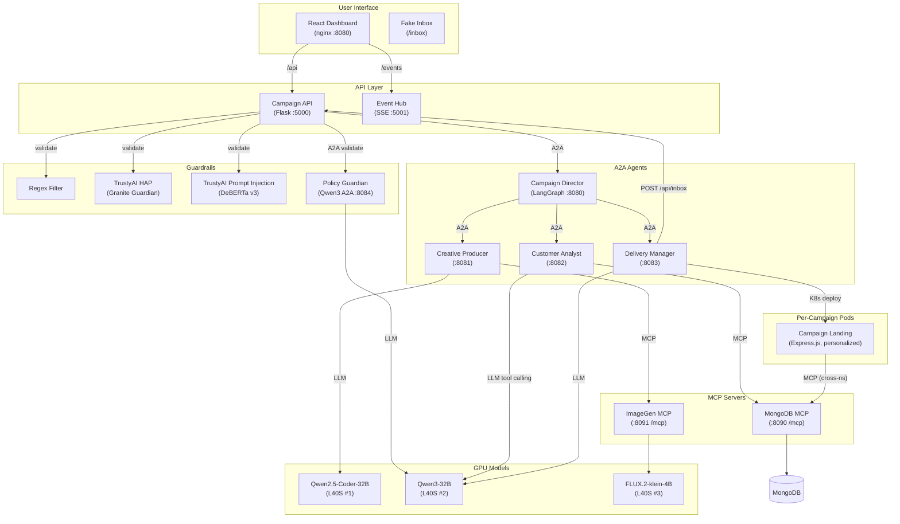
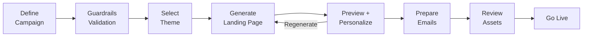
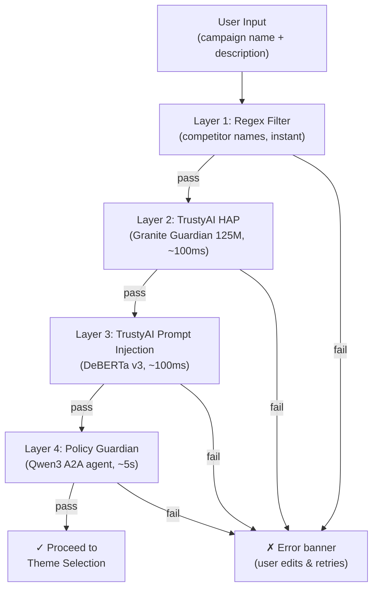

# Simon Casino Resort — AI Campaign Manager

A multi-agent AI marketing campaign assistant using A2A protocol, MCP tools, and LLM inference on Red Hat OpenShift AI. Generates personalized luxury landing pages, marketing email campaigns, and AI hero images — all orchestrated by autonomous agents. Fully integrated with [KAgenti](https://github.com/kagenti/kagenti) for Kubernetes-native agent discovery and chat-based interaction.

## Architecture



## How It Works

When a user creates a campaign, here's what happens under the hood:

**1. Landing Page Generation** — The Campaign Director (LangGraph) delegates to Creative Producer, which first calls ImageGen MCP to generate a hero banner via FLUX.2 on GPU #3, then streams HTML/CSS from Qwen Coder on GPU #1 with the image URL injected. The Delivery Manager deploys this as a live Express.js pod on OpenShift with a public URL.

**2. Customer Retrieval** — The Customer Analyst sends the target audience (e.g., "Platinum members") to Qwen3 on GPU #2, which uses function calling to pick the right MongoDB MCP tool (`get_customers_by_tier`, `get_prospects`, etc.). The MCP server queries the real MongoDB database and returns customer profiles.

**3. Email Generation** — The Delivery Manager calls Qwen3 to write email content (English only) with `{{campaign_link}}` placeholders. On Go Live, each recipient's link is replaced with their personalized URL (`?c=VIP-001`), and emails are posted to the fake inbox.

**4. Personalization** — Each campaign landing page is an Express.js pod that, on every page load, calls MongoDB MCP in real-time (cross-namespace) to fetch the customer data for the `?c=` query parameter. Same page, different URL — completely different personalized experience.

### Communication Protocols

| From | To | Protocol | Purpose |
|------|----|----------|---------|
| Frontend | Campaign API | REST | Standard web API |
| Campaign API | Agents | A2A (JSON-RPC) | Standardized agent communication |
| Agents | MCP Servers | MCP (http / Streamable HTTP) | Standardized tool access |
| Agents | LLMs (Qwen, FLUX) | OpenAI API (streaming) | vLLM-compatible inference |
| Agents | Event Hub | HTTP POST | Publish real-time status updates |
| Event Hub | Frontend | SSE | Push agent activity to browser |
| Delivery Manager | OpenShift | K8s API | Deploy campaign pods |
| Campaign Landing | MongoDB MCP | MCP (cross-namespace) | Real-time personalization lookup |

## Components

| Component | Port | Purpose |
|-----------|------|---------|
| React Dashboard | 8080 | Campaign portal UI (nginx) |
| Campaign API | 5000 | REST gateway, guardrails validation, fake inbox API |
| Event Hub | 5001 | Real-time SSE agent status |
| Campaign Director | 8080 | LangGraph workflow orchestrator |
| Creative Producer | 8081 | AI image + HTML landing page generation |
| Customer Analyst | 8082 | LLM-driven customer retrieval via MCP |
| Delivery Manager | 8083 | Email generation + K8s deployment |
| Policy Guardian | 8084 | Business policy validation (Qwen3 A2A agent) |
| MongoDB MCP | 8090 | Customer database tools (FastMCP 3.x) |
| ImageGen MCP | 8091 | AI image generation + serving (FastMCP 3.x hybrid) |
| Campaign Landing | 8080/pod | Per-campaign Express.js personalized landing pages |
| MongoDB | 27017 | Customer/prospect database |

## Key Features

- **AI-Generated Landing Pages** — Qwen Coder creates unique HTML/CSS with every generation
- **AI Hero Images** — FLUX.2 generates atmospheric campaign banners via MCP
- **Hero Image Dashboard Cards** — Campaign overview cards reuse each campaign's generated hero image as a thumbnail for richer demo storytelling
- **Hyper-Personalization** — Landing pages personalize per VIP customer (`?c=VIP-001`) via real-time MCP lookup
- **Professional Templates** — Skeleton-based "Bones & Beauty" architecture ensures polished layouts every time
- **4-Layer Guardrails** — Regex → TrustyAI HAP → TrustyAI Prompt Injection → Policy Guardian (Qwen3)
- **Gmail-Style Inbox** — Fake inbox shows personalized emails per recipient with campaign QR codes
- **Real-Time Agent Status** — SSE streaming shows agent activity during generation
- **Preview Before Commit** — Review landing page, emails, and recipients before going live
- **KAgenti Integration** — All agents discoverable via Kubernetes labels, with Bearer JWT security schemes, dual-mode input (structured + chat), and role-based MCP access

## Getting Started

### Prerequisites

- OpenShift 4.19+ cluster with **RHOAI 3.3 installed and configured**
- 3x NVIDIA L40S GPUs (or equivalent, 48GB VRAM each)
- **3 models deployed and serving** (see below)
- `oc` CLI logged in to the cluster
- Container images pushed to a registry (see "Build Images" below)

### Step 1: Deploy Models

This demo assumes RHOAI is set up and the 3 GPU models are already deployed and serving. If not, you can set them up using any of these methods:

**Option A: RHOAI Dashboard UI** — Deploy models through the web console using the model names and vLLM args from `k8s/models/README.md`

**Option B: [RHOAI-Toolkit](https://github.com/gymnatics/RHOAI-Toolkit)** (recommended for automation) — Handles MinIO storage, model download from HuggingFace, and serving in one flow:
```bash
git clone https://github.com/gymnatics/RHOAI-Toolkit.git && cd RHOAI-Toolkit
export NAMESPACE=<model-namespace>
./scripts/setup-model-storage.sh -n $NAMESPACE
./scripts/download-model.sh s3 RedHatAI/Qwen2.5-Coder-32B-Instruct-FP8-dynamic
./scripts/download-model.sh s3 RedHatAI/Qwen3-32B-FP8-dynamic
./scripts/download-model.sh s3 black-forest-labs/FLUX.2-klein-4B
./scripts/serve-model.sh s3 qwen25-coder RedHatAI/Qwen2.5-Coder-32B-Instruct-FP8-dynamic "--max-model-len 16384 --gpu-memory-utilization 0.95 --enable-auto-tool-choice --tool-call-parser hermes"
./scripts/serve-model.sh s3 qwen3 RedHatAI/Qwen3-32B-FP8-dynamic "--dtype auto --max-model-len 16000 --gpu-memory-utilization 0.90 --enable-auto-tool-choice --tool-call-parser hermes"
RUNTIME=omni ./scripts/serve-model.sh s3 flux2-klein black-forest-labs/FLUX.2-klein-4B "--gpu-memory-utilization 0.90"
```

**Option C: Kustomize manifests** — Reference YAMLs in `k8s/models/` (requires S3 data connections pre-configured):
```bash
oc apply -k k8s/models/ -n <model-namespace>
```

Verify all 3 models are ready: `oc get inferenceservice -n <model-namespace>` (all should show `READY: True`).

### Step 2: Deploy the App

```bash
./deploy.sh
```

The script will:
1. Auto-detect your cluster domain
2. Find running models and auto-assign them (code / language / image)
3. Let you override model assignments if needed
4. Generate config (ConfigMap + Secret) with the correct endpoints
5. Deploy all 11 services via Kustomize
6. Apply RBAC for cross-namespace landing page deployments
7. Seed MongoDB with sample customer data

### Step 3: Use the App

1. Open the **Frontend URL** printed at the end of `deploy.sh`
2. Click **Create New Campaign**
3. Use the **Quick Start** dropdown to auto-fill a sample campaign, or type your own
4. Pick a **theme** and click **Next** — watch the AI agents generate a landing page in real-time
5. **Preview** the landing page, select VIPs from the dropdown to see personalization
6. Click **Prepare Emails** — AI retrieves customers and generates email content
7. **Review** everything, then click **Go Live** — deploys to production and sends emails
8. Check the **Inbox** page to see personalized emails per recipient

### Build Images (if modifying code)

```bash
./build-and-push.sh
```

### Reset Demo (clean slate)

```bash
./reset-demo.sh
```

Removes all generated campaign pods (keeps the pre-generated nginx one), restarts services to clear in-memory state and inbox.

### Deploy to a Different Cluster

1. Copy `k8s/overlays/dev/` to `k8s/overlays/<your-name>/`
2. Run `./deploy.sh` — it auto-detects your cluster and models
3. See `k8s/models/README.md` for model storage options (S3 vs PVC)

## Workflow



1. **Define Campaign** — Name, description, hotel, audience, dates
2. **Guardrails Validation** — 4-layer check (regex, HAP, prompt injection, policy) before proceeding
3. **Select Theme** — Visual style picker (Luxury Gold, Festive Red, Modern Black, Classic Casino)
4. **Generate Landing Page** — AI generates hero image (FLUX.2) + HTML/CSS (Qwen Coder), deploys preview pod
5. **Preview + Personalize** — Review landing page, select VIP from dropdown for personalized preview
6. **Prepare Emails** — LLM selects MCP tool for customer retrieval, generates email content (English only)
7. **Review** — Email preview, recipient list, campaign summary
8. **Go Live** — Deploy to production, send personalized emails to fake inbox

## Guardrails

All user input is validated through 4 layers before campaign creation proceeds:



- **No restart needed** — user edits the input and retries on the same screen
- **Policy Guardian** validates business rules: no unrealistic discounts (>50%), professional tone, no misleading promises
- **Descriptive rejection banners** — the UI shows which guardrail layer failed, why it failed, and how to revise the campaign brief

## KAgenti Integration

All A2A agents and MCP servers are annotated for [KAgenti](https://github.com/kagenti/kagenti) — a Kubernetes-native agent management framework:

- **Auto-Discovery** — Agents carry `kagenti.io/type: agent` + `protocol.kagenti.io/a2a` labels; MCP servers carry `kagenti.io/type: tool` + `protocol.kagenti.io/mcp` labels
- **Uniform Port** — All agent K8s Services expose port `8080` (named `a2a`) regardless of container port, enabling standard KAgenti discovery
- **Agent Cards** — `GET /.well-known/agent-card.json` on all agents (securitySchemes, skills, capabilities)
- **Security** — Bearer JWT `securitySchemes` declared on all AgentCards
- **Chat Mode** — Agents accept both structured JSON (programmatic A2A) and plain-text natural language (KAgenti dashboard chat)
- **Role-Based Access** — MongoDB MCP supports `allowed_tiers` for scoped customer data access

## Technology Stack

- **Frontend**: React 18, TypeScript, Headless UI, Heroicons
- **API Gateway**: Flask 3.0, Flask-CORS
- **Agent Protocol**: A2A SDK 0.3.25 (JSON-RPC 2.0, `a2a-sdk[http-server]`)
- **MCP Transport**: FastMCP 3.x (Streamable HTTP at `/mcp`)
- **Orchestration**: LangGraph 0.2+, LangChain 0.2+
- **LLM Inference**: vLLM on RHOAI (Qwen2.5-Coder-32B, Qwen3-32B)
- **Image Generation**: vLLM-Omni 0.18.0 (FLUX.2-klein-4B)
- **Guardrails**: TrustyAI (Granite Guardian, DeBERTa v3) + Policy Guardian (Qwen3)
- **Database**: MongoDB 7
- **Landing Pages**: Express.js on UBI9 Node 18 (personalized via MCP)
- **Agent Management**: KAgenti (Kubernetes-native agent discovery + catalog)
- **Platform**: Red Hat OpenShift AI 3.3, 3x NVIDIA L40S GPUs

## Models

| Model | GPU | Purpose | HuggingFace |
|-------|-----|---------|-------------|
| Qwen2.5-Coder-32B-Instruct-FP8-dynamic | L40S #1 | HTML/CSS/JS generation | [RedHatAI/Qwen2.5-Coder-32B-Instruct-FP8-dynamic](https://huggingface.co/RedHatAI/Qwen2.5-Coder-32B-Instruct-FP8-dynamic) |
| Qwen3-32B-FP8-Dynamic | L40S #2 | Email gen, tool calling, policy validation | [RedHatAI/Qwen3-32B-FP8-dynamic](https://huggingface.co/RedHatAI/Qwen3-32B-FP8-dynamic) |
| FLUX.2-klein-4B | L40S #3 | AI hero image generation (vLLM-Omni) | [black-forest-labs/FLUX.2-klein-4B](https://huggingface.co/black-forest-labs/FLUX.2-klein-4B) |
| Granite Guardian HAP 125M | CPU | Hate/abuse/profanity detection (TrustyAI) | [ibm-granite/granite-guardian-hap-125m](https://huggingface.co/ibm-granite/granite-guardian-hap-125m) |
| DeBERTa v3 Prompt Injection v2 | CPU | Prompt injection detection (TrustyAI) | [protectai/deberta-v3-base-prompt-injection-v2](https://huggingface.co/protectai/deberta-v3-base-prompt-injection-v2) |

## Project Structure

```
├── frontend/                    # React Dashboard (nginx)
├── services/
│   ├── campaign-api/            # Flask API Gateway + guardrails + inbox
│   ├── event-hub/               # SSE Broadcasting
│   ├── campaign-director/       # LangGraph Orchestrator (A2A)
│   ├── creative-producer/       # HTML Generation (A2A)
│   ├── customer-analyst/        # Customer Profiles (A2A + MCP)
│   ├── delivery-manager/        # Email + K8s Deploy (A2A)
│   ├── policy-guardian/         # Business Policy Validation (A2A)
│   ├── mongodb-mcp/             # Customer DB MCP Server
│   ├── imagegen-mcp/            # AI Image Gen MCP Server
│   └── campaign-landing/        # Personalized Landing Pages (Express.js)
├── shared/models.py             # Shared Pydantic models + themes
├── k8s/                         # Kubernetes manifests (Kustomize)
│   ├── base/                    # Namespace-agnostic manifests
│   ├── overlays/dev/            # Cluster-specific config
│   ├── guardrails/              # TrustyAI detector deployment
│   ├── imagegen/                # vLLM-Omni ServingRuntime
│   └── rbac.yaml                # Cross-namespace permissions
├── build-and-push.sh            # Build & push all container images
├── deploy.sh                    # Interactive OpenShift deployment
└── docker-compose.yaml          # Local development (all services)
```

## Documentation

For deeper technical details — sequence diagrams, A2A/MCP protocol flows, LangGraph workflows, KAgenti integration, K8s deployment internals, personalization architecture, and observability — see:

- **[ARCHITECTURE.md](ARCHITECTURE.md)** — Full architecture reference with Mermaid diagrams for every data flow, including KAgenti discovery, security schemes, and dual-mode input
