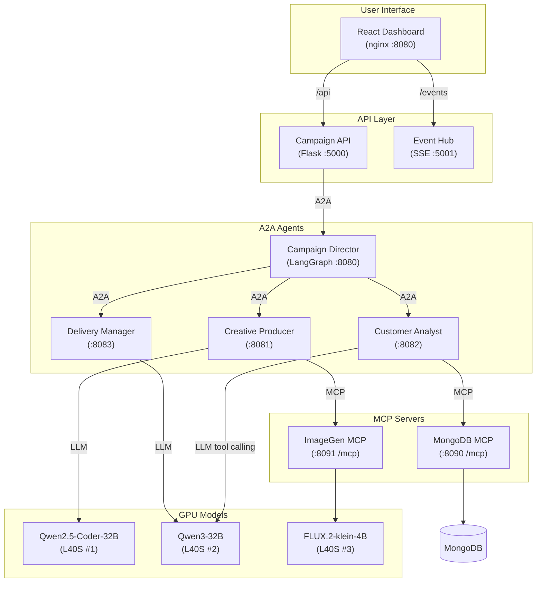

# Grand Lisboa Palace — AI Campaign Manager

A multi-agent AI marketing campaign assistant using A2A protocol, MCP tools, and LLM inference on Red Hat OpenShift AI.

## Architecture



## Components

| Component | Port | Purpose |
|-----------|------|---------|
| React Dashboard | 8080 | Campaign portal UI (nginx) |
| Campaign API | 5000 | REST gateway + A2A client |
| Event Hub | 5001 | Real-time SSE agent status |
| Campaign Director | 8080 | LangGraph workflow orchestrator |
| Creative Producer | 8081 | AI image + HTML landing page generation |
| Customer Analyst | 8082 | LLM-driven customer retrieval via MCP |
| Delivery Manager | 8083 | Email generation + K8s deployment |
| MongoDB MCP | 8090 | Customer database tools (streamable-http) |
| ImageGen MCP | 8091 | AI image generation + serving (hybrid MCP) |
| MongoDB | 27017 | Customer/prospect database |

## Quick Start

### Local Development

```bash
cp .env.example .env
# Edit .env with your model endpoints and tokens

docker-compose up
```

Access: http://localhost:3000

### OpenShift Deployment

```bash
# 1. Namespace and RBAC
oc apply -f k8s/namespace.yaml
oc apply -f k8s/rbac.yaml

# 2. Config (edit secret with your tokens first)
oc apply -f k8s/configmap.yaml
oc apply -f k8s/secret-example.yaml

# 3. Deploy services
oc apply -f k8s/mcp/
oc apply -f k8s/agents/
oc apply -f k8s/api/
oc apply -f k8s/frontend/

# 4. Seed MongoDB
oc exec deployment/mongodb-mcp -- env MONGODB_URI=mongodb://mongodb:27017 python3 seed_data.py
```

## Workflow

1. **Create Campaign** — Define name, description, hotel, audience, dates
2. **Select Theme** — Choose visual style (Luxury Gold, Festive Red, Modern Black, Classic Casino)
3. **Generate Landing Page** — AI generates hero image (FLUX.2) + HTML/CSS (Qwen Coder)
4. **Preview** — Review landing page, regenerate for different layouts
5. **Prepare Emails** — LLM selects MCP tool for customer retrieval, generates email content (EN + ZH)
6. **Go Live** — Deploy to production + send emails

## Technology Stack

- **Frontend**: React 18, TypeScript, Headless UI, Heroicons
- **API Gateway**: Flask 3.0, Flask-CORS
- **Agent Protocol**: A2A SDK 0.3.25 (JSON-RPC 2.0, `a2a-sdk[http-server]`)
- **MCP Transport**: FastMCP 2.12+ (streamable-http at `/mcp`)
- **Orchestration**: LangGraph 0.2+, LangChain 0.2+
- **LLM Inference**: vLLM on RHOAI (Qwen2.5-Coder-32B, Qwen3-32B)
- **Image Generation**: vLLM-Omni 0.18.0 (FLUX.2-klein-4B)
- **Database**: MongoDB 7
- **Platform**: Red Hat OpenShift AI 3.3, 3x NVIDIA L40S GPUs

## Documentation

- [ARCHITECTURE.md](ARCHITECTURE.md) — Detailed architecture, data flows, sequence diagrams
