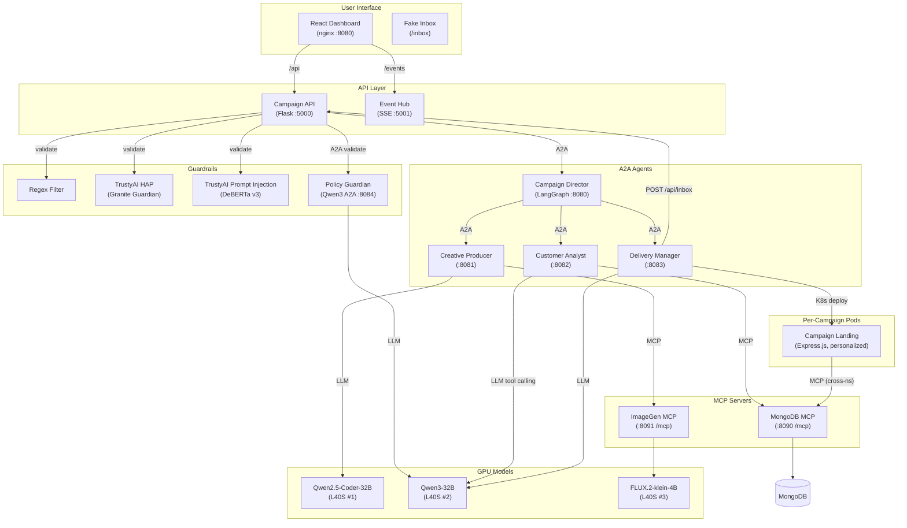
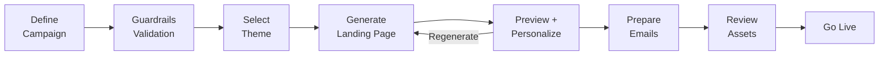
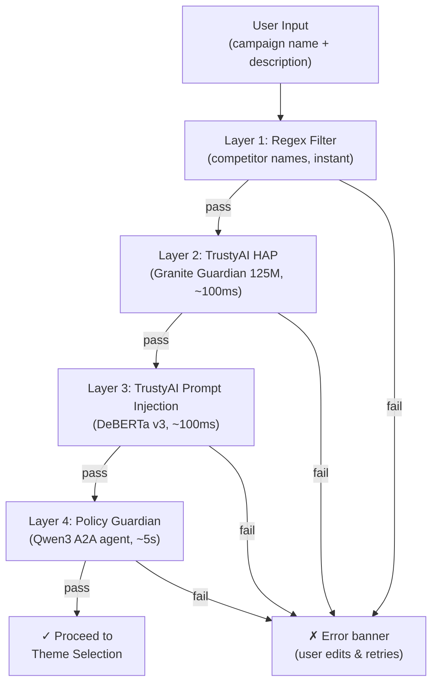

# Simon Casino Resort — AI Campaign Manager

A multi-agent AI marketing campaign assistant using A2A protocol, MCP tools, and LLM inference on Red Hat OpenShift AI. Generates personalized luxury landing pages, bilingual email campaigns, and AI hero images — all orchestrated by autonomous agents.

## Architecture



## Components

| Component | Port | Purpose |
|-----------|------|---------|
| React Dashboard | 8080 | Campaign portal UI (nginx) |
| Campaign API | 5000 | REST gateway, guardrails validation, fake inbox API |
| Event Hub | 5001 | Real-time SSE agent status |
| Campaign Director | 8080 | LangGraph workflow orchestrator |
| Creative Producer | 8081 | AI image + HTML landing page generation |
| Customer Analyst | 8082 | LLM-driven customer retrieval via MCP |
| Delivery Manager | 8083 | Email generation + K8s deployment |
| Policy Guardian | 8084 | Business policy validation (Qwen3 A2A agent) |
| MongoDB MCP | 8090 | Customer database tools (FastMCP streamable-http) |
| ImageGen MCP | 8091 | AI image generation + serving (FastMCP hybrid) |
| Campaign Landing | 8080/pod | Per-campaign Express.js personalized landing pages |
| MongoDB | 27017 | Customer/prospect database |

## Key Features

- **AI-Generated Landing Pages** — Qwen Coder creates unique HTML/CSS with every generation
- **AI Hero Images** — FLUX.2 generates atmospheric campaign banners via MCP
- **Hyper-Personalization** — Landing pages personalize per VIP customer (`?c=VIP-001`) via real-time MCP lookup
- **Bilingual** — All content in English (primary) + Chinese (subtitle)
- **4-Layer Guardrails** — Regex → TrustyAI HAP → TrustyAI Prompt Injection → Policy Guardian (Qwen3)
- **Gmail-Style Inbox** — Fake inbox shows personalized emails per recipient with campaign QR codes
- **Real-Time Agent Status** — SSE streaming shows agent activity during generation
- **Preview Before Commit** — Review landing page, emails, and recipients before going live

## Quick Start

### Local Development

```bash
cp .env.example .env
# Edit .env with your model endpoints and tokens

docker-compose up
```

Access: http://localhost:3000

### OpenShift Deployment

```bash
# Option A: Interactive deployment (recommended)
./deploy.sh

# Option B: Manual Kustomize
oc apply -k k8s/overlays/dev
oc exec deployment/mongodb-mcp -- env MONGODB_URI=mongodb://mongodb:27017 python3 seed_data.py
oc apply -f k8s/imagegen/serving-runtime.yaml
```

### Build & Push Images

```bash
./build-and-push.sh
```

### RBAC (Required for New Clusters)

The Delivery Manager deploys campaign landing pages to dev/prod namespaces. Grant permissions:

```bash
oc apply -f k8s/rbac.yaml
```

**For a different cluster:** Copy `k8s/overlays/dev/` to `k8s/overlays/<your-name>/`, edit `configmap-patch.yaml` (cluster domain, namespaces) and `secret.yaml` (model endpoints, tokens).

## Workflow



1. **Define Campaign** — Name, description, hotel, audience, dates
2. **Guardrails Validation** — 4-layer check (regex, HAP, prompt injection, policy) before proceeding
3. **Select Theme** — Visual style picker (Luxury Gold, Festive Red, Modern Black, Classic Casino)
4. **Generate Landing Page** — AI generates hero image (FLUX.2) + HTML/CSS (Qwen Coder), deploys preview pod
5. **Preview + Personalize** — Review landing page, select VIP from dropdown for personalized preview
6. **Prepare Emails** — LLM selects MCP tool for customer retrieval, generates email content (EN + ZH)
7. **Review** — Email preview, recipient list, campaign summary
8. **Go Live** — Deploy to production, send personalized emails to fake inbox

## Guardrails

All user input is validated through 4 layers before campaign creation proceeds:



- **No restart needed** — user edits the input and retries on the same screen
- **Policy Guardian** validates business rules: no unrealistic discounts (>50%), professional tone, no misleading promises

## Technology Stack

- **Frontend**: React 18, TypeScript, Headless UI, Heroicons
- **API Gateway**: Flask 3.0, Flask-CORS
- **Agent Protocol**: A2A SDK 0.3.25 (JSON-RPC 2.0, `a2a-sdk[http-server]`)
- **MCP Transport**: FastMCP 2.12+ (streamable-http at `/mcp`)
- **Orchestration**: LangGraph 0.2+, LangChain 0.2+
- **LLM Inference**: vLLM on RHOAI (Qwen2.5-Coder-32B, Qwen3-32B)
- **Image Generation**: vLLM-Omni 0.18.0 (FLUX.2-klein-4B)
- **Guardrails**: TrustyAI (Granite Guardian, DeBERTa v3) + Policy Guardian (Qwen3)
- **Database**: MongoDB 7
- **Landing Pages**: Express.js on UBI9 Node 18 (personalized via MCP)
- **Platform**: Red Hat OpenShift AI 3.3, 3x NVIDIA L40S GPUs

## Models

| Model | GPU | Purpose | HuggingFace |
|-------|-----|---------|-------------|
| Qwen2.5-Coder-32B-Instruct-FP8 | L40S #1 | HTML/CSS/JS generation | [neuralmagic/Qwen2.5-Coder-32B-Instruct-FP8](https://huggingface.co/neuralmagic/Qwen2.5-Coder-32B-Instruct-FP8) |
| Qwen3-32B-FP8-Dynamic | L40S #2 | Email gen, tool calling, policy validation | [RedHatAI/Qwen3-32B-FP8-dynamic](https://huggingface.co/RedHatAI/Qwen3-32B-FP8-dynamic) |
| FLUX.2-klein-4B | L40S #3 | AI hero image generation (vLLM-Omni) | [black-forest-labs/FLUX.2-klein-4B](https://huggingface.co/black-forest-labs/FLUX.2-klein-4B) |
| Granite Guardian HAP 125M | CPU | Hate/abuse/profanity detection (TrustyAI) | [ibm-granite/granite-guardian-hap-125m](https://huggingface.co/ibm-granite/granite-guardian-hap-125m) |
| DeBERTa v3 Prompt Injection v2 | CPU | Prompt injection detection (TrustyAI) | [protectai/deberta-v3-base-prompt-injection-v2](https://huggingface.co/protectai/deberta-v3-base-prompt-injection-v2) |

## Project Structure

```
├── frontend/                    # React Dashboard (nginx)
├── services/
│   ├── campaign-api/            # Flask API Gateway + guardrails + inbox
│   ├── event-hub/               # SSE Broadcasting
│   ├── campaign-director/       # LangGraph Orchestrator (A2A)
│   ├── creative-producer/       # HTML Generation (A2A)
│   ├── customer-analyst/        # Customer Profiles (A2A + MCP)
│   ├── delivery-manager/        # Email + K8s Deploy (A2A)
│   ├── policy-guardian/         # Business Policy Validation (A2A)
│   ├── mongodb-mcp/             # Customer DB MCP Server
│   ├── imagegen-mcp/            # AI Image Gen MCP Server
│   └── campaign-landing/        # Personalized Landing Pages (Express.js)
├── shared/models.py             # Shared Pydantic models + themes
├── k8s/                         # Kubernetes manifests (Kustomize)
│   ├── base/                    # Namespace-agnostic manifests
│   ├── overlays/dev/            # Cluster-specific config
│   ├── guardrails/              # TrustyAI detector deployment
│   ├── imagegen/                # vLLM-Omni ServingRuntime
│   └── rbac.yaml                # Cross-namespace permissions
├── build-and-push.sh            # Build & push all container images
├── deploy.sh                    # Interactive OpenShift deployment
└── docker-compose.yaml          # Local development (all services)
```

## Documentation

For deeper technical details — sequence diagrams, A2A/MCP protocol flows, LangGraph workflows, K8s deployment internals, personalization architecture, and observability — see:

- **[ARCHITECTURE.md](ARCHITECTURE.md)** — Full architecture reference with Mermaid diagrams for every data flow
